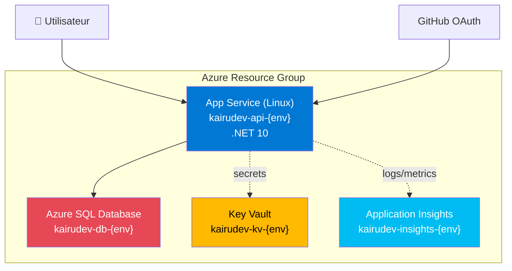

# Kairudev — Guide de déploiement Azure

Ce document décrit le processus de déploiement de Kairudev sur Azure en utilisant Bicep et GitHub Actions.

---

## Architecture Azure déployée



**Composants :**
- **App Service Plan** (B1 dev, P1v3 prod) : héberge l'API ASP.NET Core + Blazor WASM
- **Azure SQL Database** (Basic dev, S1 prod) : stockage des données (remplace SQLite)
- **Key Vault** : gestion sécurisée des secrets (GitHub OAuth, JWT, connection string)
- **Application Insights** : monitoring et diagnostics

**Coûts estimés (dev) :** ~15-20€/mois (B1 + Basic SQL)  
**Coûts estimés (prod) :** ~150-200€/mois (P1v3 + S1 SQL)

---

## Prérequis

### 1. Outils locaux
```powershell
# Azure CLI
winget install Microsoft.AzureCLI

# Azure PowerShell
Install-Module -Name Az -Repository PSGallery -Force

# Vérification
az --version
Get-Module -ListAvailable Az
```

### 2. Compte Azure
- Subscription Azure active
- Droits `Contributor` ou `Owner` sur la subscription
- Connexion : `Connect-AzAccount`

### 3. GitHub OAuth App
1. Allez sur https://github.com/settings/developers
2. Créez une **OAuth App** :
   - **Application name** : Kairudev (Dev/Prod)
   - **Homepage URL** : `https://kairudev-api-dev.azurewebsites.net`
   - **Authorization callback URL** : `https://kairudev-api-dev.azurewebsites.net/api/auth/github/callback`
3. Notez `Client ID` et générez `Client Secret`

---

## Déploiement manuel (PowerShell)

### 1. Définir les variables d'environnement

```powershell
# GitHub OAuth (depuis votre OAuth App)
$env:GITHUB_CLIENT_ID = "Ov23liXXXXXXXXXXXX"
$env:GITHUB_CLIENT_SECRET = "1234567890abcdef1234567890abcdef12345678"

# JWT Secret (généré automatiquement si non fourni)
$env:JWT_SECRET_KEY = "votre-cle-base64-32-bytes-minimum"

# SQL Admin Password (complexité requise : maj, min, chiffre, symbole)
$env:SQL_ADMIN_PASSWORD = "YourStrongP@ssw0rd123!"
```

### 2. Exécuter le script de déploiement

```powershell
cd C:\Users\oliver254\dev\Kairudev

# Déploiement dev
.\infra\deploy.ps1 -Environment dev -ResourceGroupName rg-kairudev-dev

# Déploiement prod
.\infra\deploy.ps1 -Environment prod -ResourceGroupName rg-kairudev-prod

# Mode WhatIf (validation sans déploiement)
.\infra\deploy.ps1 -Environment dev -ResourceGroupName rg-kairudev-dev -WhatIf
```

**Durée :** 5-10 minutes (création SQL Database longue)

### 3. Vérifier le déploiement

Le script affiche les outputs :
```
✅ Déploiement réussi!

📊 Outputs:
  webAppUrl : https://kairudev-api-dev.azurewebsites.net
  sqlServerFqdn : kairudev-sql-dev.database.windows.net
  keyVaultName : kairudev-kv-dev
  ...
```

Vérifiez sur le portail Azure : https://portal.azure.com

---

## Migration SQLite → Azure SQL

### Problème : EF Core SQLite vs SQL Server

Kairudev utilise SQLite en développement local. Azure utilise SQL Server. Certaines migrations peuvent nécessiter des ajustements.

### Approche 1 : Génération de script SQL (recommandée)

```powershell
cd src/Kairudev.Api

# Générer un script SQL pour toutes les migrations
dotnet ef migrations script --idempotent --output migrations.sql

# Exécuter le script sur Azure SQL (via Azure Data Studio, SSMS, ou sqlcmd)
```

### Approche 2 : Migration automatique au démarrage

Ajoutez dans `Program.cs` (API) :

```csharp
// Après builder.Build()
using (var scope = app.Services.CreateScope())
{
    var dbContext = scope.ServiceProvider.GetRequiredService<KairudevDbContext>();
    dbContext.Database.Migrate(); // ⚠️ Uniquement en dev/staging, pas en prod
}
```

**⚠️ Avertissement :** Migrations automatiques risquées en production. Privilégiez Approche 1 pour prod.

### Approche 3 : Multi-provider (avancé)

Ajoutez `Microsoft.EntityFrameworkCore.SqlServer` et détection dynamique :

```csharp
// Dans Program.cs
var isSqlite = connectionString.Contains("Data Source=");
if (isSqlite)
    builder.Services.AddDbContext<KairudevDbContext>(o => o.UseSqlite(connectionString));
else
    builder.Services.AddDbContext<KairudevDbContext>(o => o.UseSqlServer(connectionString));
```

---

## Déploiement du code (CI/CD GitHub Actions)

### 1. Configurer les secrets GitHub

Dans votre repository GitHub : **Settings** → **Secrets and variables** → **Actions**

Créez les **Repository secrets** :

| Secret | Valeur | Description |
|---|---|---|
| `AZURE_CREDENTIALS` | JSON Azure Service Principal | Credentials pour déploiement automatique |
| `GITHUB_CLIENT_ID` | Client ID GitHub OAuth | Même valeur que déploiement manuel |
| `GITHUB_CLIENT_SECRET` | Client Secret GitHub OAuth | Même valeur que déploiement manuel |
| `JWT_SECRET_KEY` | Base64 secret (32+ bytes) | Même valeur que déploiement manuel |
| `SQL_ADMIN_PASSWORD` | Mot de passe SQL | Même valeur que déploiement manuel |

### 2. Créer Azure Service Principal

```powershell
# Récupérer votre subscription ID
$subscriptionId = (Get-AzContext).Subscription.Id

# Créer un Service Principal avec rôle Contributor
$sp = New-AzADServicePrincipal -DisplayName "kairudev-github-actions" `
    -Role "Contributor" `
    -Scope "/subscriptions/$subscriptionId/resourceGroups/rg-kairudev-dev"

# Générer le JSON pour AZURE_CREDENTIALS
@{
    clientId = $sp.AppId
    clientSecret = $sp.PasswordCredentials.SecretText
    subscriptionId = $subscriptionId
    tenantId = (Get-AzContext).Tenant.Id
} | ConvertTo-Json

# ⚠️ Copiez ce JSON dans le secret AZURE_CREDENTIALS sur GitHub
```

### 3. Déploiement automatique

GitHub Actions se déclenche :
- **Automatiquement** : push sur `main` (prod) ou `staging` (staging)
- **Manuellement** : onglet **Actions** → **Deploy to Azure** → **Run workflow**

Workflow :
1. ✅ Build .NET 10
2. ✅ Tests (166 tests)
3. ✅ Publish API + Blazor WASM
4. ✅ Deploy sur Azure App Service
5. ✅ (Optionnel) Migrations EF Core

---

## Configuration post-déploiement

### 1. Configurer GitHub OAuth callback

Dans votre GitHub OAuth App :
- **Authorization callback URL** : `https://kairudev-api-{env}.azurewebsites.net/api/auth/github/callback`

### 2. Configurer CORS (si nécessaire)

Si Blazor WASM est hébergé séparément de l'API, ajoutez CORS dans `Program.cs` :

```csharp
builder.Services.AddCors(options =>
{
    options.AddDefaultPolicy(policy =>
    {
        policy.WithOrigins("https://kairudev-web-{env}.azurewebsites.net")
              .AllowAnyHeader()
              .AllowAnyMethod();
    });
});
```

### 3. Activer les logs Application Insights

Les logs sont automatiquement envoyés à Application Insights via la connection string configurée.

Consultez les logs :
- Portail Azure → Application Insights → **Logs** (Kusto query)
- Exemple : `traces | where message contains "error" | take 100`

### 4. Health check

L'App Service appelle `/health` toutes les 5 minutes (configuré dans Bicep).

Vérifiez manuellement : `https://kairudev-api-{env}.azurewebsites.net/health`

---

## Environnements

| Environnement | Branch | Resource Group | URL |
|---|---|---|---|
| **dev** | `feature/*` | `rg-kairudev-dev` | https://kairudev-api-dev.azurewebsites.net |
| **staging** | `staging` | `rg-kairudev-staging` | https://kairudev-api-staging.azurewebsites.net |
| **prod** | `main` | `rg-kairudev-prod` | https://kairudev-api-prod.azurewebsites.net |

---

## Dépannage

### Erreur : "Key Vault access denied"

**Cause :** L'identité managée de l'App Service n'a pas encore accès au Key Vault (délai de propagation RBAC).

**Solution :**
1. Attendez 5-10 minutes après le déploiement
2. Vérifiez le role assignment : Portail Azure → Key Vault → **Access control (IAM)**
3. Redémarrez l'App Service : `az webapp restart --name kairudev-api-dev --resource-group rg-kairudev-dev`

### Erreur : "Cannot connect to SQL Database"

**Cause :** Firewall SQL bloque votre IP.

**Solution :**
```powershell
# Ajouter votre IP publique
$myIp = (Invoke-WebRequest -Uri "https://ifconfig.me/ip").Content.Trim()
New-AzSqlServerFirewallRule -ResourceGroupName rg-kairudev-dev `
    -ServerName kairudev-sql-dev `
    -FirewallRuleName "MyDevMachine" `
    -StartIpAddress $myIp `
    -EndIpAddress $myIp
```

### Erreur : "GitHub OAuth callback mismatch"

**Cause :** L'URL de callback GitHub ne correspond pas.

**Solution :**
1. GitHub OAuth App → **Settings**
2. **Authorization callback URL** : `https://kairudev-api-{env}.azurewebsites.net/api/auth/github/callback` (exact)
3. Sauvegardez

### Logs détaillés

```powershell
# Stream logs en temps réel
az webapp log tail --name kairudev-api-dev --resource-group rg-kairudev-dev

# Télécharger logs
az webapp log download --name kairudev-api-dev --resource-group rg-kairudev-dev --log-file logs.zip
```

---

## Rollback

En cas de problème après déploiement :

### Via portail Azure
1. App Service → **Deployment Center** → **Logs**
2. Sélectionnez le déploiement précédent → **Redeploy**

### Via CLI
```powershell
# Lister les déploiements
az webapp deployment list --name kairudev-api-dev --resource-group rg-kairudev-dev

# Rollback vers un déploiement spécifique
az webapp deployment source config-zip --name kairudev-api-dev `
    --resource-group rg-kairudev-dev `
    --src ./previous-version.zip
```

---

## Nettoyage (suppression complète)

```powershell
# ⚠️ SUPPRIME TOUTES LES RESSOURCES (données incluses)
Remove-AzResourceGroup -Name rg-kairudev-dev -Force

# Suppression du Service Principal GitHub Actions
Remove-AzADServicePrincipal -DisplayName "kairudev-github-actions"
```

---

## Coûts et optimisation

### Estimation mensuelle (dev)
- App Service B1 : ~13€
- Azure SQL Basic : ~5€
- Key Vault : ~0.03€
- Application Insights : ~0€ (5GB gratuit)
- **Total :** ~18€/mois

### Estimation mensuelle (prod)
- App Service P1v3 : ~120€
- Azure SQL S1 : ~30€
- Key Vault : ~0.03€
- Application Insights : ~2€ (selon volume)
- **Total :** ~152€/mois

### Optimisations
- **Auto-scaling** : App Service peut scaler automatiquement (P1v3+)
- **Reserved Instances** : -30% si engagement 1 an sur SQL
- **Dev/Test pricing** : -55% sur SQL si subscription MSDN/Visual Studio
- **Pause SQL Database** : réduction coûts en dev (serverless tier)

---

## Références

- [Bicep documentation](https://learn.microsoft.com/azure/azure-resource-manager/bicep/)
- [App Service .NET 10](https://learn.microsoft.com/azure/app-service/quickstart-dotnetcore)
- [Azure SQL Database](https://learn.microsoft.com/azure/azure-sql/database/)
- [Key Vault managed identities](https://learn.microsoft.com/azure/key-vault/general/managed-identity)
- [GitHub Actions Azure](https://learn.microsoft.com/azure/developer/github/github-actions)
