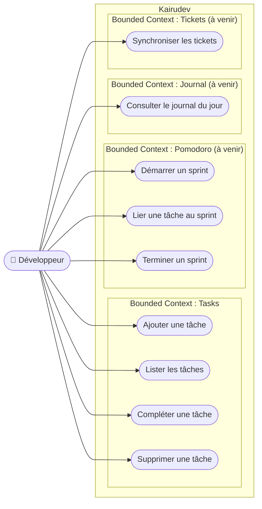
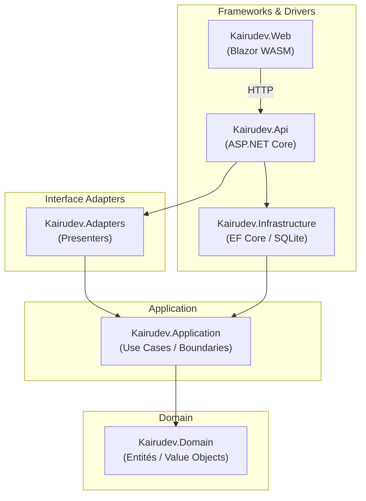
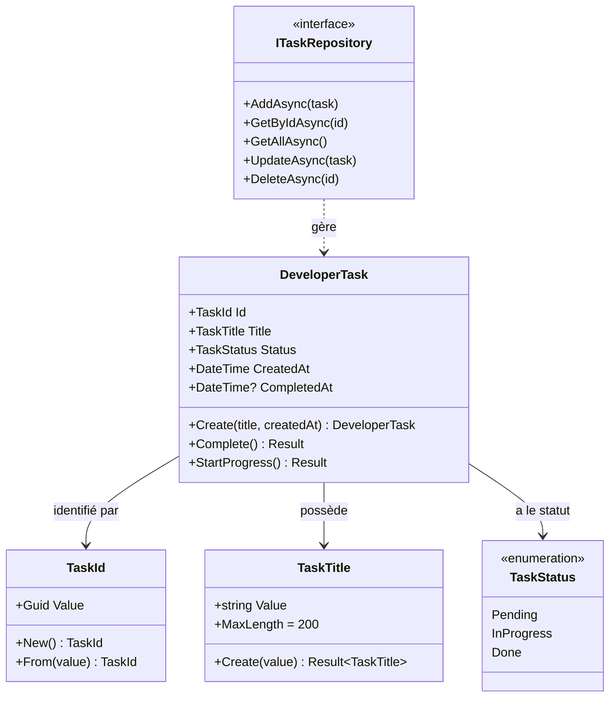
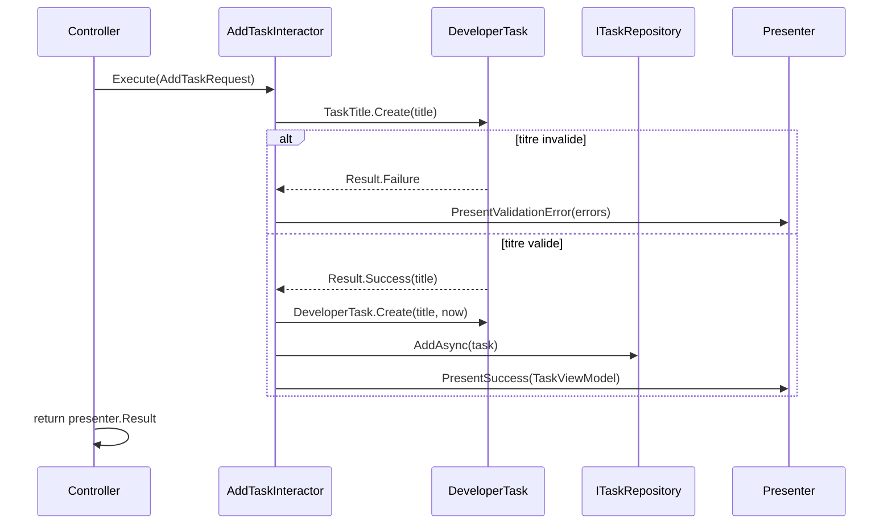
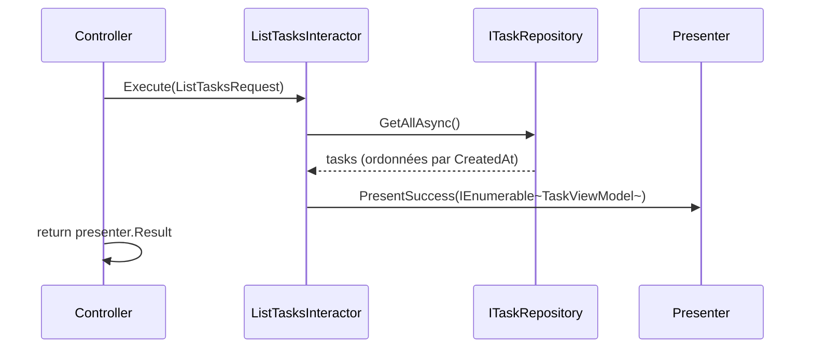
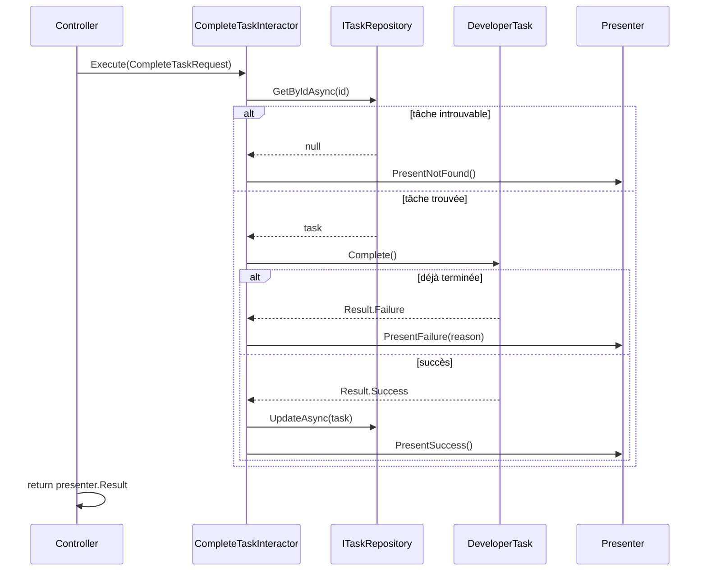
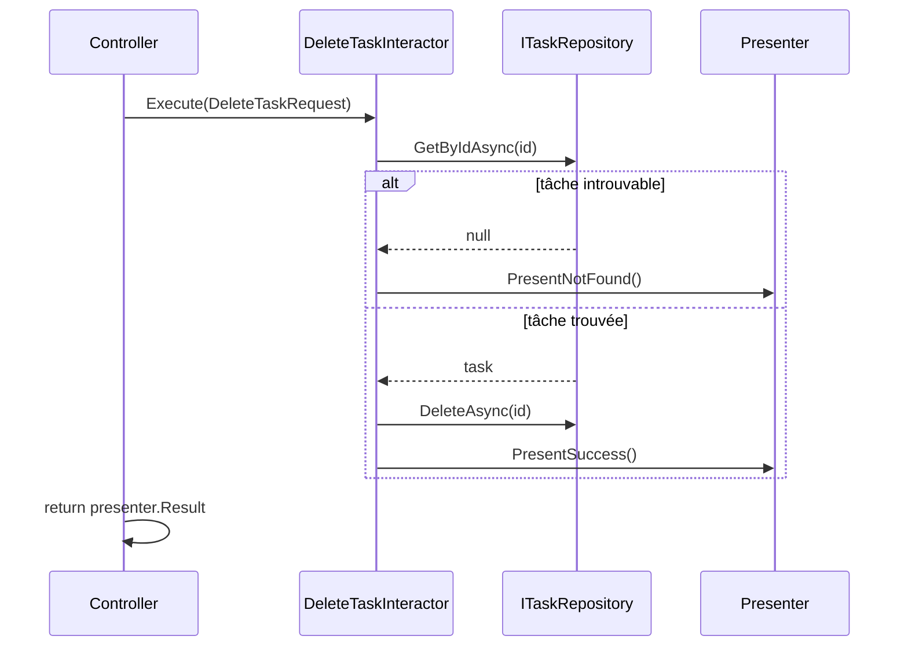
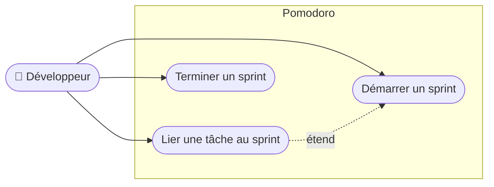

# Kairudev — Spécification fonctionnelle et architecturale

## Vision produit
Application de gestion d'activité quotidienne pour développeurs.
Elle centralise en un seul endroit tout ce dont un développeur a besoin pour rester focus et organisé :
todo list de micro-tâches, journal de bord, intégration tickets, sessions Pomodoro.

---

## Acteurs

| Acteur | Description |
|---|---|
| **Développeur** | Utilisateur unique de l'application |

---

## Vue d'ensemble — Cas d'utilisation

---

## Architecture cible

> La règle fondamentale : les dépendances pointent uniquement vers l'intérieur.
> Le Domain ne connaît rien de ce qui l'entoure.

---

## Bounded Context : Tasks

### Modèle du domaine

---

### UC-01 — Ajouter une tâche

**Acteur principal :** Développeur
**Parties prenantes :** —
**Préconditions :** —
**Postconditions (succès) :** une tâche est créée avec le statut `Pending`, persistée, et retournée.

**Scénario nominal :**
1. Le développeur saisit un titre de tâche.
2. Le système valide le titre (non vide, ≤ 200 caractères).
3. Le système crée la tâche avec un identifiant unique, le statut `Pending` et la date de création.
4. Le système persiste la tâche.
5. Le système retourne la tâche créée.

**Scénarios alternatifs :** —

**Scénarios d'exception :**
- E1 : titre vide ou composé uniquement d'espaces → erreur de validation, aucune tâche créée.
- E2 : titre supérieur à 200 caractères → erreur de validation, aucune tâche créée.

**Critères d'acceptance :**
- [x] Une tâche créée a le statut `Pending`
- [x] L'identifiant est unique (UUID)
- [x] Le titre est trimé des espaces en début et fin
- [x] Titre vide → rejeté
- [x] Titre > 200 caractères → rejeté

---

### UC-02 — Lister les tâches

**Acteur principal :** Développeur
**Parties prenantes :** —
**Préconditions :** —
**Postconditions (succès) :** la liste complète des tâches est retournée, ordonnée par date de création.

**Scénario nominal :**
1. Le développeur demande la liste des tâches.
2. Le système récupère toutes les tâches persistées.
3. Le système retourne les tâches triées par date de création (plus ancienne en premier).

**Scénarios alternatifs :**
- A1 : aucune tâche existante → le système retourne une liste vide.

**Scénarios d'exception :** —

**Critères d'acceptance :**
- [x] La liste est ordonnée par `CreatedAt` croissant
- [x] Une liste vide est un résultat valide (pas une erreur)

---

### UC-03 — Compléter une tâche

**Acteur principal :** Développeur
**Parties prenantes :** —
**Préconditions :** la tâche identifiée existe.
**Postconditions (succès) :** la tâche passe au statut `Done`, la date de complétion est enregistrée.

**Scénario nominal :**
1. Le développeur désigne une tâche à compléter (par son identifiant).
2. Le système vérifie que la tâche existe.
3. Le système vérifie que la tâche n'est pas déjà terminée.
4. Le système passe la tâche au statut `Done` et enregistre la date de complétion.
5. Le système persiste la modification.

**Scénarios d'exception :**
- E1 : tâche introuvable → erreur `NotFound`.
- E2 : tâche déjà au statut `Done` → erreur métier.

**Critères d'acceptance :**
- [x] Une tâche complétée a le statut `Done`
- [x] `CompletedAt` est renseignée
- [x] Compléter une tâche déjà `Done` est rejeté
- [x] Identifiant inexistant → `NotFound`

---

### UC-04 — Supprimer une tâche

**Acteur principal :** Développeur
**Parties prenantes :** —
**Préconditions :** la tâche identifiée existe.
**Postconditions (succès) :** la tâche est supprimée de la persistance.

**Scénario nominal :**
1. Le développeur désigne une tâche à supprimer (par son identifiant).
2. Le système vérifie que la tâche existe.
3. Le système supprime la tâche.

**Scénarios d'exception :**
- E1 : tâche introuvable → erreur `NotFound`.

**Critères d'acceptance :**
- [x] La tâche n'existe plus après suppression
- [x] Identifiant inexistant → `NotFound`

---

## Bounded Context : Pomodoro (à venir)

> Use cases à détailler lors de l'itération concernée.

**Concepts clés identifiés :**
- Un **sprint Pomodoro** a une durée fixe (ex. 25 min), un statut, une description libre.
- Pendant un sprint, le développeur peut lier des tâches (`Tasks`) : les marquer en cours ou les terminer.
- Un sprint peut couvrir plusieurs tâches ; une tâche peut être travaillée sur plusieurs sprints.
- Les activités d'un sprint alimentent le **Journal**.

---

## Bounded Context : Journal (à venir)

> Use cases à détailler lors de l'itération concernée.

**Concept clé :** log d'activité quotidien généré automatiquement à partir des sprints Pomodoro et des tâches. Répond à la question *"qu'est-ce que j'ai fait aujourd'hui ?"*.

---

## Bounded Context : Tickets (à venir)

> Use cases à détailler lors de l'itération concernée.

---

## ADR (Architecture Decision Records)

### ADR-001 — Clean Architecture + boundary pattern
- **Contexte :** Besoin d'une base solide, évolutive, testable, multi-UI (Web + MAUI).
- **Décision :** Couches Domain / Application / Adapters / Infrastructure. Boundary pattern complet : chaque Use Case expose un `IInputBoundary` et un `IOutputBoundary`. L'Interactor ne retourne rien — il pousse le résultat via le presenter.
- **Conséquences :** Use Cases indépendants de l'UI et de la persistance. Ajout Web/MAUI sans toucher au Domain.

### ADR-002 — SQLite via EF Core (fichier local)
- **Contexte :** Première itération, zéro infrastructure.
- **Décision :** SQLite + EF Core, fichier `kairudev.db` exclu du git. `ITaskRepository` dans Domain, implémentation dans Infrastructure.
- **Conséquences :** Swap PostgreSQL = nouvelle implémentation, aucun impact sur Domain/Application.

### ADR-003 — .NET 10 preview
- **Contexte :** Choix imposé.
- **Décision :** Cible `net10.0`. Warning `NETSDK1057` non bloquant.
- **Conséquences :** À surveiller lors du passage en release.

### ADR-004 — Controllers composent les Interactors
- **Contexte :** Le presenter HTTP est spécifique à chaque requête.
- **Décision :** Le Controller instancie le presenter et l'Interactor à chaque action, avec `ITaskRepository` injecté via DI.
- **Conséquences :** Composition explicite, pas de factory supplémentaire.

### ADR-005 — Blazor WebAssembly standalone
- **Contexte :** Cible multi-UI, partage futur de composants avec MAUI via Blazor Hybrid.
- **Décision :** Blazor WASM standalone, communication uniquement via API REST. `TaskDto` défini dans le projet Web.
- **Conséquences :** Projet Web totalement découplé du backend.
