# Kairudev — Spécification fonctionnelle et architecturale

## Vision produit
Application de gestion d'activité quotidienne pour développeurs.
Elle centralise en un seul endroit tout ce dont un développeur a besoin pour rester focus et organisé :
todo list de micro-tâches, journal de bord, intégration tickets, sessions Pomodoro.

---

## Acteurs

| Acteur | Description |
|---|---|
| **Développeur** | Utilisateur unique de l'application |

---

## Vue d'ensemble — Cas d'utilisation

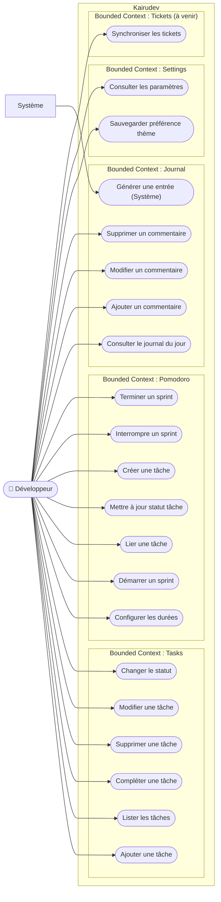
```mermaid
flowchart LR
    Dev(["👤 Développeur"])

    subgraph Kairudev["Kairudev"]
        subgraph Tasks["Bounded Context : Tasks"]
            UC1(["Ajouter une tâche"])
            UC2(["Lister les tâches"])
            UC3(["Compléter une tâche"])
            UC4(["Supprimer une tâche"])
            UC5(["Modifier une tâche"])
            UC12(["Changer le statut"])
        end

        subgraph Pomodoro["Bounded Context : Pomodoro"]
            P05(["Configurer les durées"])
            P06(["Démarrer un sprint"])
            P07(["Lier une tâche"])
            P08(["Mettre à jour statut tâche"])
            P09(["Créer une tâche"])
            P10(["Interrompre un sprint"])
            P11(["Terminer un sprint"])
        end

        subgraph Journal["Bounded Context : Journal"]
            UC13(["Consulter le journal du jour"])
            UC14(["Ajouter un commentaire"])
            UC15(["Modifier un commentaire"])
            UC16(["Supprimer un commentaire"])
            UCS1(["Générer une entrée (Système)"])
        end

        subgraph Settings["Bounded Context : Settings"]
            UC17(["Sauvegarder préférence thème"])
            UC18(["Consulter les paramètres"])
        end

        subgraph Tickets["Bounded Context : Tickets (à venir)"]
            UC9(["Synchroniser les tickets"])
        end
    end

    Dev --> UC1
    Dev --> UC2
    Dev --> UC3
    Dev --> UC4
    Dev --> UC5
    Dev --> UC12
    Dev --> P05
    Dev --> P06
    Dev --> P07
    Dev --> P08
    Dev --> P09
    Dev --> P10
    Dev --> P11
    Dev --> UC13
    Dev --> UC14
    Dev --> UC15
    Dev --> UC16
    Dev --> UC17
    Dev --> UC18
    Système --> UCS1
    Dev --> UC9
```

---

## Architecture cible

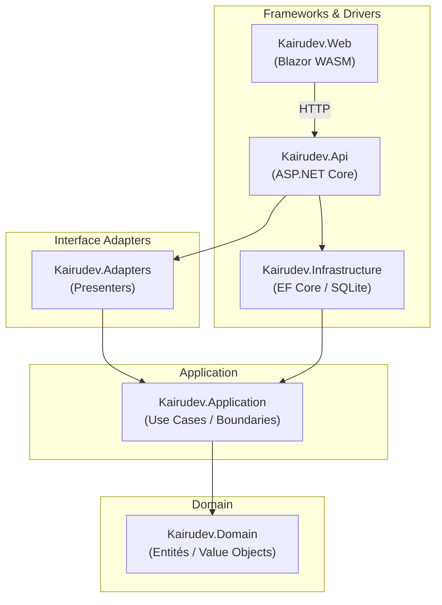
```mermaid
flowchart TB
    subgraph Ext["Frameworks & Drivers"]
        Web["Kairudev.Web\n(Blazor WASM)"]
        API["Kairudev.Api\n(ASP.NET Core)"]
        Infra["Kairudev.Infrastructure\n(EF Core / SQLite)"]
    end

    subgraph Adp["Interface Adapters"]
        A["Kairudev.Adapters\n(Presenters)"]
    end

    subgraph App["Application"]
        UC["Kairudev.Application\n(Use Cases / Boundaries)"]
    end

    subgraph Dom["Domain"]
        D["Kairudev.Domain\n(Entités / Value Objects)"]
    end

    Web -->|HTTP| API
    API --> A
    API --> Infra
    A --> UC
    Infra --> UC
    UC --> D
```

> La règle fondamentale : les dépendances pointent uniquement vers l'intérieur.
> Le Domain ne connaît rien de ce qui l'entoure.

---

## Bounded Context : Tasks

### Modèle du domaine

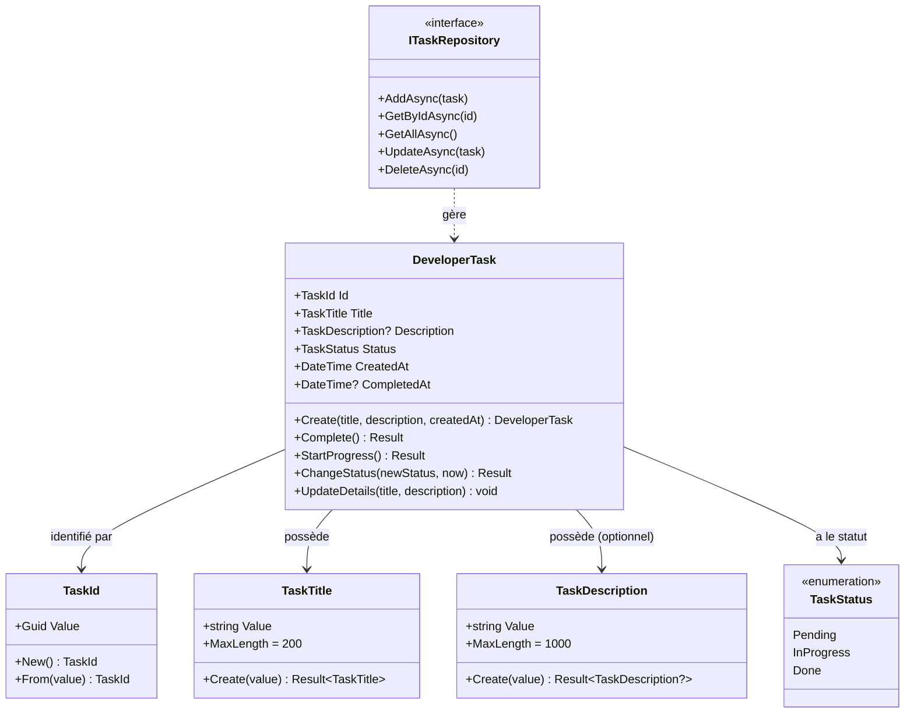
```mermaid
classDiagram
    class DeveloperTask {
        +TaskId Id
        +TaskTitle Title
        +TaskDescription? Description
        +TaskStatus Status
        +DateTime CreatedAt
        +DateTime? CompletedAt
        +Create(title, description, createdAt) DeveloperTask
        +Complete() Result
        +StartProgress() Result
        +ChangeStatus(newStatus, now) Result
        +UpdateDetails(title, description) void
    }

    class TaskId {
        +Guid Value
        +New() TaskId
        +From(value) TaskId
    }

    class TaskTitle {
        +string Value
        +MaxLength = 200
        +Create(value) Result~TaskTitle~
    }

    class TaskDescription {
        +string Value
        +MaxLength = 1000
        +Create(value) Result~TaskDescription?~
    }

    class TaskStatus {
        <<enumeration>>
        Pending
        InProgress
        Done
    }

    class ITaskRepository {
        <<interface>>
        +AddAsync(task)
        +GetByIdAsync(id)
        +GetAllAsync()
        +UpdateAsync(task)
        +DeleteAsync(id)
    }

    DeveloperTask --> TaskId : identifié par
    DeveloperTask --> TaskTitle : possède
    DeveloperTask --> TaskDescription : possède (optionnel)
    DeveloperTask --> TaskStatus : a le statut
    ITaskRepository ..> DeveloperTask : gère
```

---

### UC-01 — Ajouter une tâche

**Acteur principal :** Développeur
**Parties prenantes :** —
**Préconditions :** —
**Postconditions (succès) :** une tâche est créée avec le statut `Pending`, persistée, et retournée.

**Scénario nominal :**
1. Le développeur saisit un titre de tâche.
2. Le système valide le titre (non vide, ≤ 200 caractères).
3. Le système crée la tâche avec un identifiant unique, le statut `Pending` et la date de création.
4. Le système persiste la tâche.
5. Le système retourne la tâche créée.

**Scénarios alternatifs :** —

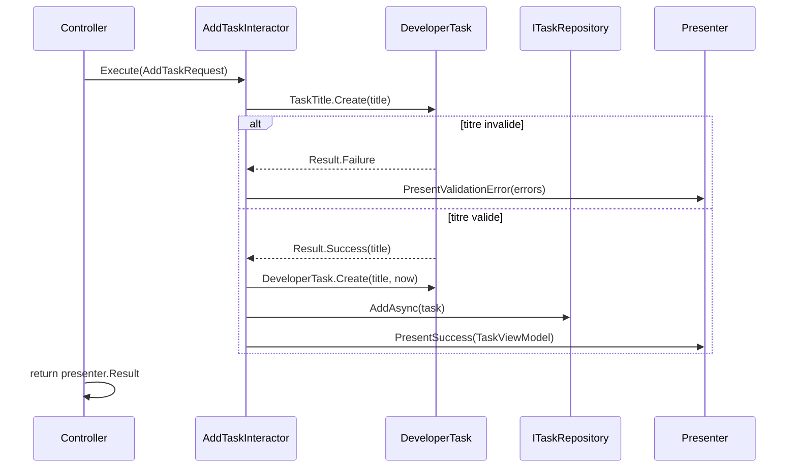
```mermaid
sequenceDiagram
    participant C as Controller
    participant I as AddTaskInteractor
    participant T as DeveloperTask
    participant R as ITaskRepository
    participant P as Presenter

    C->>I: Execute(AddTaskRequest)
    I->>T: TaskTitle.Create(title)
    alt titre invalide
        T-->>I: Result.Failure
        I->>P: PresentValidationError(errors)
    else titre valide
        T-->>I: Result.Success(title)
        I->>T: DeveloperTask.Create(title, now)
        I->>R: AddAsync(task)
        I->>P: PresentSuccess(TaskViewModel)
    end
    C->>C: return presenter.Result
```

**Scénarios d'exception :**
- E1 : titre vide ou composé uniquement d'espaces → erreur de validation, aucune tâche créée.
- E2 : titre supérieur à 200 caractères → erreur de validation, aucune tâche créée.

**Critères d'acceptance :**
- [x] Une tâche créée a le statut `Pending`
- [x] L'identifiant est unique (UUID)
- [x] Le titre est trimé des espaces en début et fin
- [x] Titre vide → rejeté
- [x] Titre > 200 caractères → rejeté

---

### UC-02 — Lister les tâches

**Acteur principal :** Développeur
**Parties prenantes :** —
**Préconditions :** —
**Postconditions (succès) :** la liste complète des tâches est retournée, ordonnée par date de création.

**Scénario nominal :**
1. Le développeur demande la liste des tâches.
2. Le système récupère toutes les tâches persistées.
3. Le système retourne les tâches triées par date de création (plus ancienne en premier).

**Scénarios alternatifs :**
- A1 : aucune tâche existante → le système retourne une liste vide.

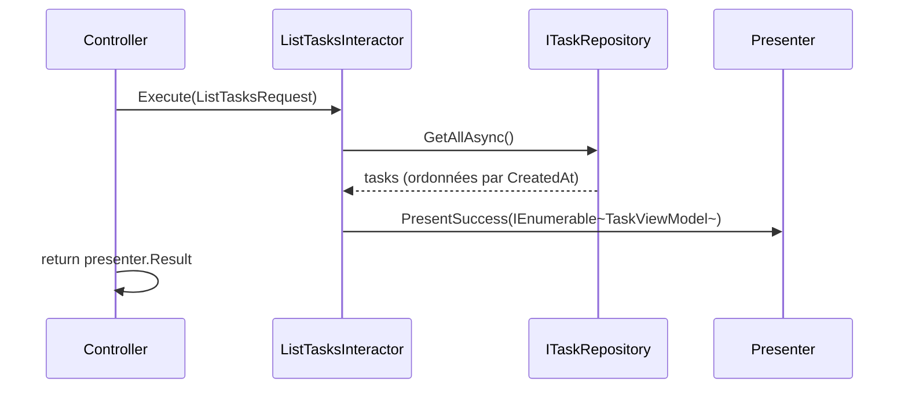
```mermaid
sequenceDiagram
    participant C as Controller
    participant I as ListTasksInteractor
    participant R as ITaskRepository
    participant P as Presenter

    C->>I: Execute(ListTasksRequest)
    I->>R: GetAllAsync()
    R-->>I: tasks (ordonnées par CreatedAt)
    I->>P: PresentSuccess(IEnumerable~TaskViewModel~)
    C->>C: return presenter.Result
```

**Scénarios d'exception :** —

**Critères d'acceptance :**
- [x] La liste est ordonnée par `CreatedAt` croissant
- [x] Une liste vide est un résultat valide (pas une erreur)

---

### UC-03 — Compléter une tâche

**Acteur principal :** Développeur
**Parties prenantes :** —
**Préconditions :** la tâche identifiée existe.
**Postconditions (succès) :** la tâche passe au statut `Done`, la date de complétion est enregistrée.

**Scénario nominal :**
1. Le développeur désigne une tâche à compléter (par son identifiant).
2. Le système vérifie que la tâche existe.
3. Le système vérifie que la tâche n'est pas déjà terminée.
4. Le système passe la tâche au statut `Done` et enregistre la date de complétion.
5. Le système persiste la modification.

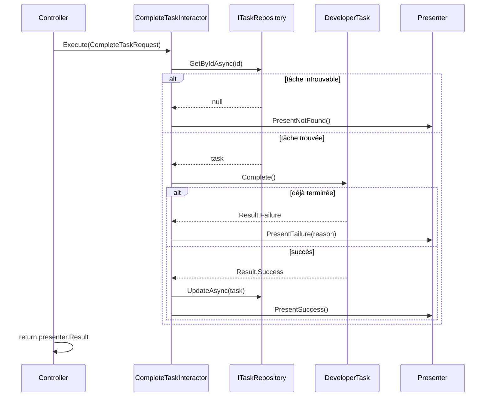
```mermaid
sequenceDiagram
    participant C as Controller
    participant I as CompleteTaskInteractor
    participant R as ITaskRepository
    participant T as DeveloperTask
    participant P as Presenter

    C->>I: Execute(CompleteTaskRequest)
    I->>R: GetByIdAsync(id)
    alt tâche introuvable
        R-->>I: null
        I->>P: PresentNotFound()
    else tâche trouvée
        R-->>I: task
        I->>T: Complete()
        alt déjà terminée
            T-->>I: Result.Failure
            I->>P: PresentFailure(reason)
        else succès
            T-->>I: Result.Success
            I->>R: UpdateAsync(task)
            I->>P: PresentSuccess()
        end
    end
    C->>C: return presenter.Result
```

**Scénarios d'exception :**
- E1 : tâche introuvable → erreur `NotFound`.
- E2 : tâche déjà au statut `Done` → erreur métier.

**Critères d'acceptance :**
- [x] Une tâche complétée a le statut `Done`
- [x] `CompletedAt` est renseignée
- [x] Compléter une tâche déjà `Done` est rejeté
- [x] Identifiant inexistant → `NotFound`

---

### UC-04 — Supprimer une tâche

**Acteur principal :** Développeur
**Parties prenantes :** —
**Préconditions :** la tâche identifiée existe.
**Postconditions (succès) :** la tâche est supprimée de la persistance.

**Scénario nominal :**
1. Le développeur désigne une tâche à supprimer (par son identifiant).
2. Le système vérifie que la tâche existe.
3. Le système supprime la tâche.

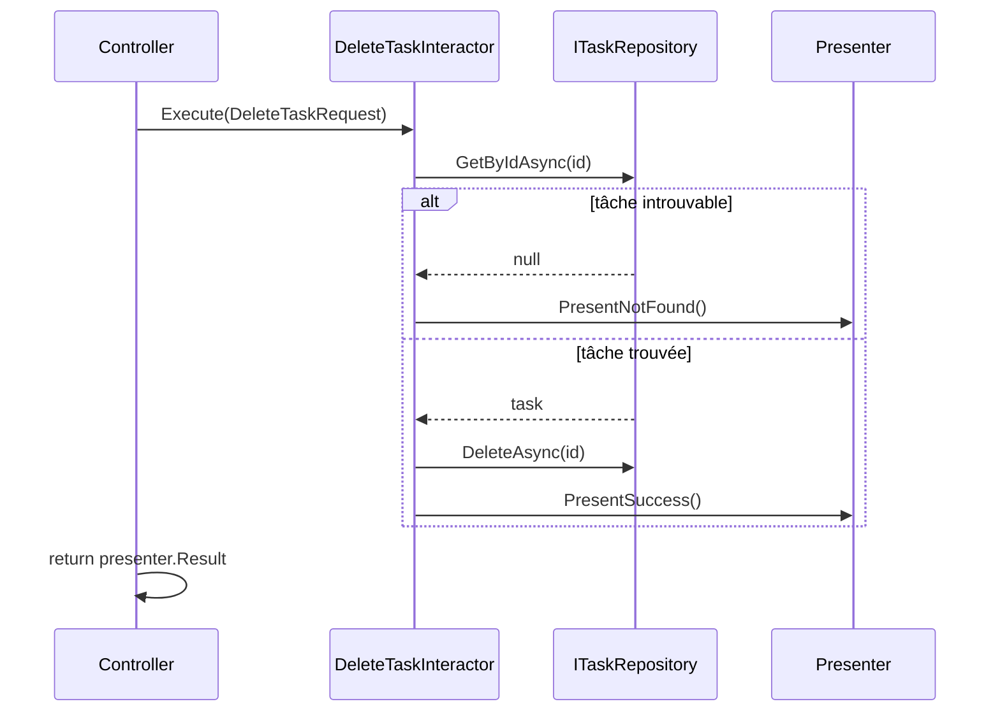
```mermaid
sequenceDiagram
    participant C as Controller
    participant I as DeleteTaskInteractor
    participant R as ITaskRepository
    participant P as Presenter

    C->>I: Execute(DeleteTaskRequest)
    I->>R: GetByIdAsync(id)
    alt tâche introuvable
        R-->>I: null
        I->>P: PresentNotFound()
    else tâche trouvée
        R-->>I: task
        I->>R: DeleteAsync(id)
        I->>P: PresentSuccess()
    end
    C->>C: return presenter.Result
```

**Scénarios d'exception :**
- E1 : tâche introuvable → erreur `NotFound`.

**Critères d'acceptance :**
- [x] La tâche n'existe plus après suppression
- [x] Identifiant inexistant → `NotFound`

### UC-12 — Changer le statut d'une tâche

**Acteur principal :** Développeur
**Parties prenantes :** —
**Préconditions :** la tâche identifiée existe.
**Postconditions (succès) :** le statut est mis à jour, `CompletedAt` ajusté, modification persistée.

**Scénario nominal :**
1. Le développeur désigne une tâche (par id) et le nouveau statut souhaité.
2. Le système vérifie que la valeur de statut est reconnue (`Pending`, `InProgress`, `Done`).
3. Le système vérifie que la tâche existe.
4. Le système vérifie que le nouveau statut est différent du statut actuel.
5. Le système applique la transition.
6. Si `→ Done` : `CompletedAt = now`. Si `Done →` autre : `CompletedAt = null`.
7. Le système persiste la modification et retourne la tâche mise à jour.

**Scénarios d'exception :**
- E1 : valeur de statut non reconnue → `400 Bad Request`.
- E2 : tâche introuvable → `404 Not Found`.
- E3 : statut identique au statut actuel → `409 Conflict` (erreur métier `SameStatus`).

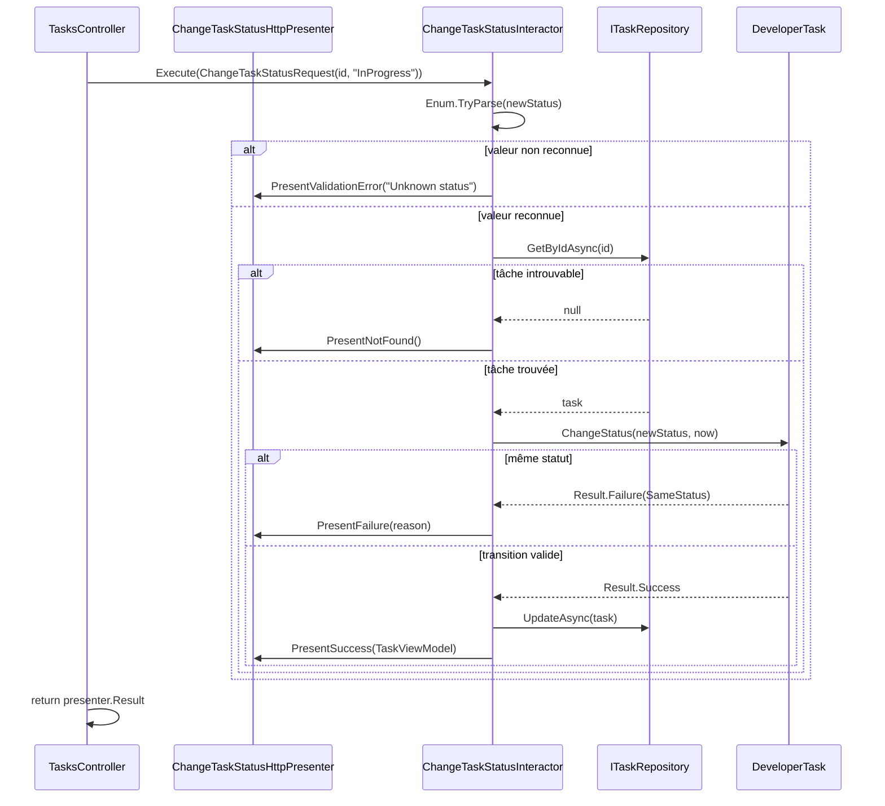
```mermaid
sequenceDiagram
    participant C as TasksController
    participant P as ChangeTaskStatusHttpPresenter
    participant I as ChangeTaskStatusInteractor
    participant R as ITaskRepository
    participant T as DeveloperTask

    C->>I: Execute(ChangeTaskStatusRequest(id, "InProgress"))
    I->>I: Enum.TryParse(newStatus)
    alt valeur non reconnue
        I->>P: PresentValidationError("Unknown status")
    else valeur reconnue
        I->>R: GetByIdAsync(id)
        alt tâche introuvable
            R-->>I: null
            I->>P: PresentNotFound()
        else tâche trouvée
            R-->>I: task
            I->>T: ChangeStatus(newStatus, now)
            alt même statut
                T-->>I: Result.Failure(SameStatus)
                I->>P: PresentFailure(reason)
            else transition valide
                T-->>I: Result.Success
                I->>R: UpdateAsync(task)
                I->>P: PresentSuccess(TaskViewModel)
            end
        end
    end
    C->>C: return presenter.Result
```

**Critères d'acceptance :**
- [x] Les 6 transitions valides acceptées (`Pending ↔ InProgress ↔ Done`)
- [x] `* → Done` : `CompletedAt` renseigné
- [x] `Done → *` : `CompletedAt` remis à `null`
- [x] Transition identique → `409 Conflict` (`SameStatus`)
- [x] Tâche inexistante → `404 Not Found`
- [x] Valeur de statut non reconnue → `400 Bad Request`
- [x] Persistée et reflétée dans `ListTasks`

---

### UC-05 — Modifier une tâche

**Acteur principal :** Développeur  
**Parties prenantes :** —  
**Préconditions :** la tâche identifiée existe.  
**Postconditions (succès) :** le titre et/ou la description sont mis à jour, modification persistée.

**Scénario nominal :**
1. Le développeur désigne une tâche (par id) et fournit un nouveau titre et/ou une nouvelle description.
2. Le système vérifie que la tâche existe.
3. Le système valide le titre (non vide, ≤ 200 caractères).
4. Le système valide la description (≤ 1000 caractères, optionnelle).
5. Le système met à jour le titre et la description de la tâche.
6. Le système persiste la modification et retourne la tâche mise à jour.

**Scénarios d'exception :**
- E1 : tâche introuvable → `404 Not Found`.
- E2 : titre vide → `400 Bad Request` (erreur de validation).
- E3 : titre > 200 caractères → `400 Bad Request` (erreur de validation).
- E4 : description > 1000 caractères → `400 Bad Request` (erreur de validation).

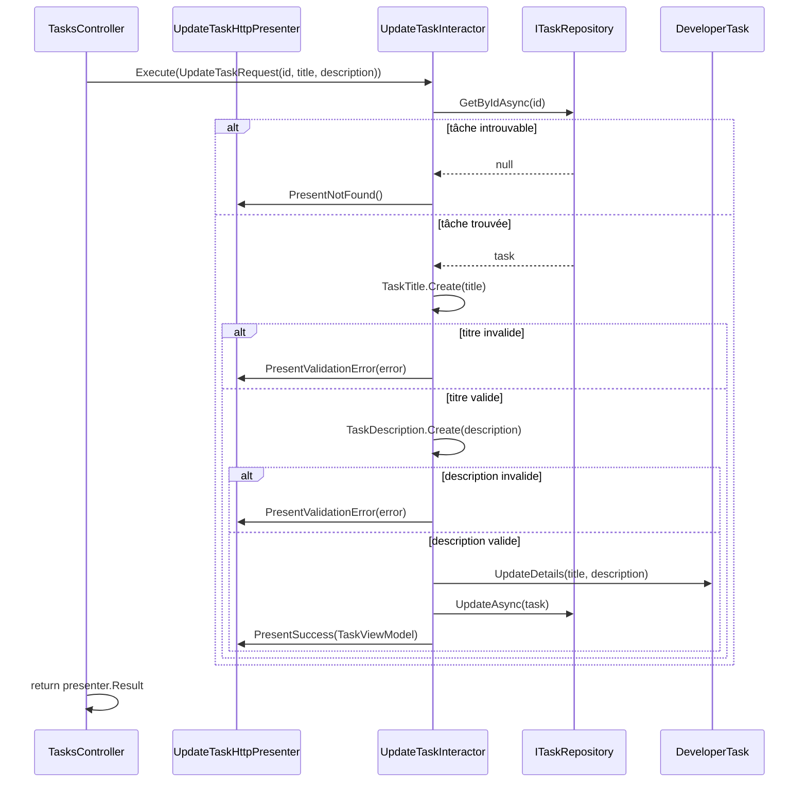
```mermaid
sequenceDiagram
    participant C as TasksController
    participant P as UpdateTaskHttpPresenter
    participant I as UpdateTaskInteractor
    participant R as ITaskRepository
    participant T as DeveloperTask

    C->>I: Execute(UpdateTaskRequest(id, title, description))
    I->>R: GetByIdAsync(id)
    alt tâche introuvable
        R-->>I: null
        I->>P: PresentNotFound()
    else tâche trouvée
        R-->>I: task
        I->>I: TaskTitle.Create(title)
        alt titre invalide
            I->>P: PresentValidationError(error)
        else titre valide
            I->>I: TaskDescription.Create(description)
            alt description invalide
                I->>P: PresentValidationError(error)
            else description valide
                I->>T: UpdateDetails(title, description)
                I->>R: UpdateAsync(task)
                I->>P: PresentSuccess(TaskViewModel)
            end
        end
    end
    C->>C: return presenter.Result
```

**Critères d'acceptance :**
- [x] Le titre peut être modifié
- [x] La description peut être ajoutée, modifiée ou supprimée (null)
- [x] Titre vide → `400 Bad Request`
- [x] Titre > 200 caractères → `400 Bad Request`
- [x] Description > 1000 caractères → `400 Bad Request`
- [x] Tâche inexistante → `404 Not Found`
- [x] Modification persistée et reflétée dans `ListTasks`

---

## Bounded Context : Pomodoro

### Modèle du domaine

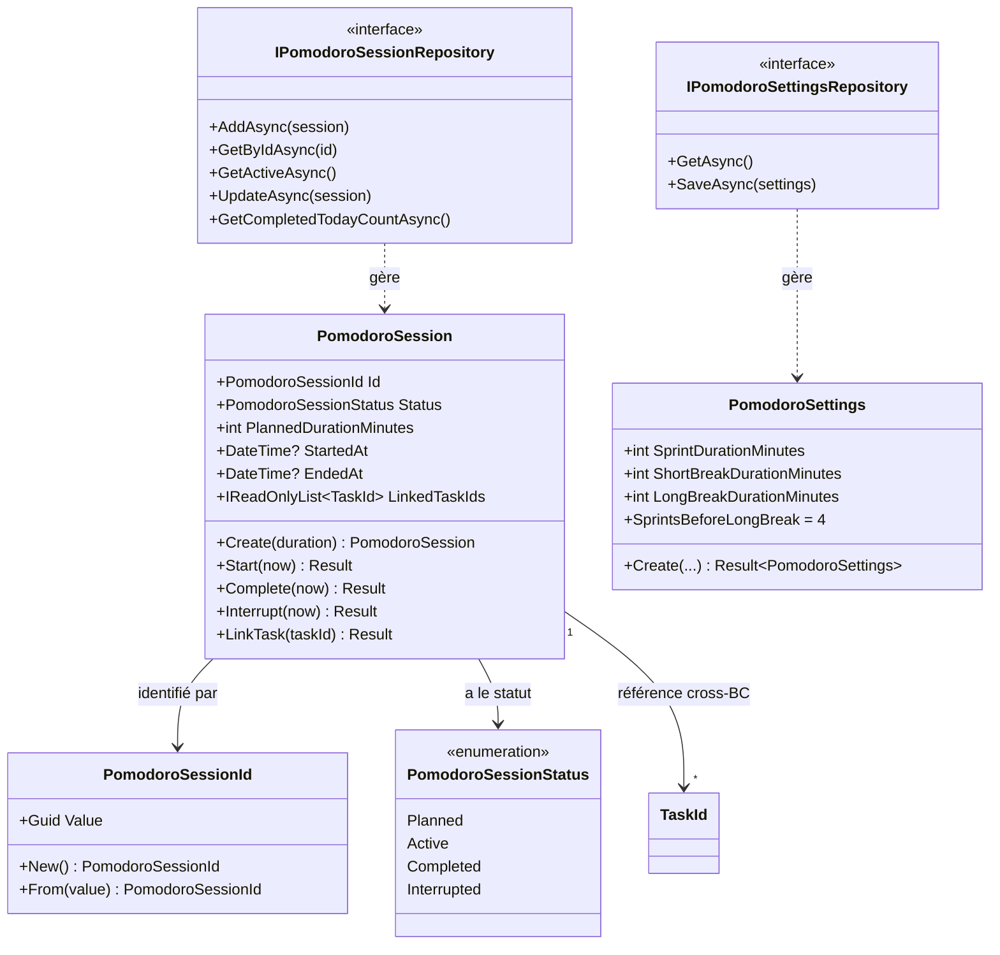
```mermaid
classDiagram
    class PomodoroSession {
        +PomodoroSessionId Id
        +PomodoroSessionStatus Status
        +int PlannedDurationMinutes
        +DateTime? StartedAt
        +DateTime? EndedAt
        +IReadOnlyList~TaskId~ LinkedTaskIds
        +Create(duration) PomodoroSession
        +Start(now) Result
        +Complete(now) Result
        +Interrupt(now) Result
        +LinkTask(taskId) Result
    }

    class PomodoroSessionId {
        +Guid Value
        +New() PomodoroSessionId
        +From(value) PomodoroSessionId
    }

    class PomodoroSessionStatus {
        <<enumeration>>
        Planned
        Active
        Completed
        Interrupted
    }

    class PomodoroSettings {
        +int SprintDurationMinutes
        +int ShortBreakDurationMinutes
        +int LongBreakDurationMinutes
        +SprintsBeforeLongBreak = 4
        +Create(...) Result~PomodoroSettings~
    }

    class IPomodoroSessionRepository {
        <<interface>>
        +AddAsync(session)
        +GetByIdAsync(id)
        +GetActiveAsync()
        +UpdateAsync(session)
        +GetCompletedTodayCountAsync()
    }

    class IPomodoroSettingsRepository {
        <<interface>>
        +GetAsync()
        +SaveAsync(settings)
    }

    PomodoroSession --> PomodoroSessionId : identifié par
    PomodoroSession --> PomodoroSessionStatus : a le statut
    PomodoroSession "1" --> "*" TaskId : référence cross-BC
    IPomodoroSessionRepository ..> PomodoroSession : gère
    IPomodoroSettingsRepository ..> PomodoroSettings : gère
```

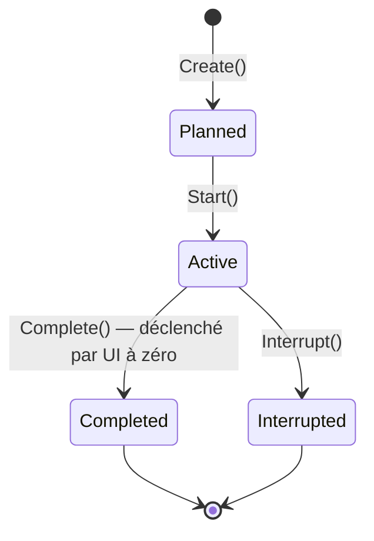
```mermaid
stateDiagram-v2
    [*] --> Planned : Create()
    Planned --> Active : Start()
    Active --> Completed : Complete() — déclenché par UI à zéro
    Active --> Interrupted : Interrupt()
    Completed --> [*]
    Interrupted --> [*]
```

> Règle cross-BC : `PomodoroSession` référence `TaskId` (BC Tasks) par valeur uniquement.
> Aucun objet `DeveloperTask` ne traverse la frontière du BC.

---

### UC-05 — Configurer les durées Pomodoro

**Acteur principal :** Développeur
**Parties prenantes :** —
**Préconditions :** —
**Postconditions (succès) :** les durées sont persistées et effectives au prochain sprint.

**Scénario nominal :**
1. Le développeur saisit les durées : sprint, pause courte, pause longue.
2. Le système valide chaque durée (1–120 minutes).
3. Le système sauvegarde les paramètres.

**Scénarios alternatifs :** —

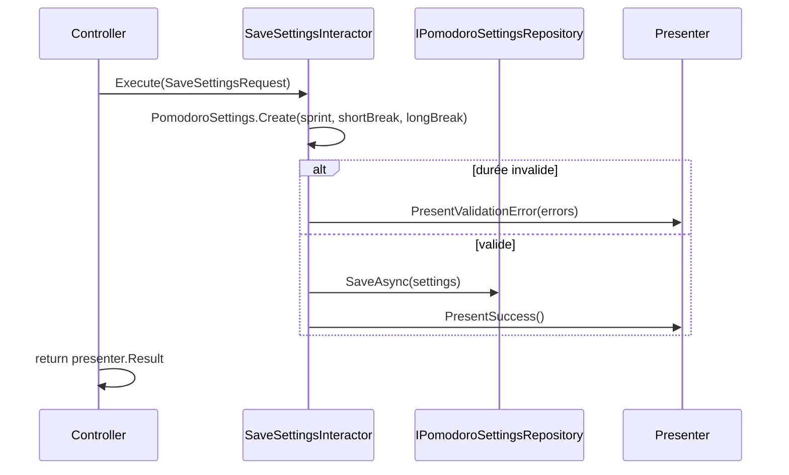
```mermaid
sequenceDiagram
    participant C as Controller
    participant I as SaveSettingsInteractor
    participant R as IPomodoroSettingsRepository
    participant P as Presenter

    C->>I: Execute(SaveSettingsRequest)
    I->>I: PomodoroSettings.Create(sprint, shortBreak, longBreak)
    alt durée invalide
        I->>P: PresentValidationError(errors)
    else valide
        I->>R: SaveAsync(settings)
        I->>P: PresentSuccess()
    end
    C->>C: return presenter.Result
```

**Scénarios d'exception :**
- E1 : une durée < 1 minute → rejetée.
- E2 : une durée > 120 minutes → rejetée.

**Critères d'acceptance :**
- [x] Durées dans [1, 120] → acceptées et persistées
- [x] Durée hors plage → rejetée, rien sauvegardé
- [x] Les durées sont chargées au démarrage de l'application
- [x] UI dédiée pour modifier les paramètres (/settings)

---

### UC-06 — Démarrer un sprint

**Acteur principal :** Développeur
**Parties prenantes :** —
**Préconditions :** aucun sprint `Active` en cours.
**Postconditions (succès) :** session créée au statut `Active`, durée configurée stockée dans la session.

**Scénario nominal :**
1. Le développeur demande le démarrage d'un sprint.
2. Le système vérifie qu'aucun sprint n'est déjà actif.
3. Le système lit la durée configurée.
4. Le système crée la session et la passe à `Active`.
5. Le système retourne la session avec sa durée pour lancer le chrono côté UI.

**Scénarios alternatifs :** —

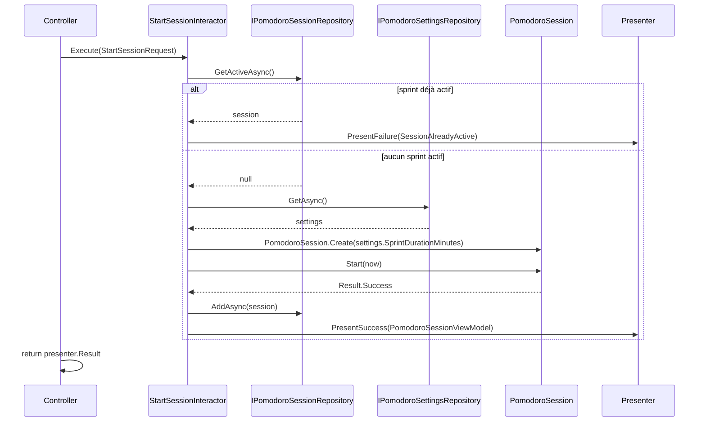
```mermaid
sequenceDiagram
    participant C as Controller
    participant I as StartSessionInteractor
    participant SR as IPomodoroSessionRepository
    participant SS as IPomodoroSettingsRepository
    participant S as PomodoroSession
    participant P as Presenter

    C->>I: Execute(StartSessionRequest)
    I->>SR: GetActiveAsync()
    alt sprint déjà actif
        SR-->>I: session
        I->>P: PresentFailure(SessionAlreadyActive)
    else aucun sprint actif
        SR-->>I: null
        I->>SS: GetAsync()
        SS-->>I: settings
        I->>S: PomodoroSession.Create(settings.SprintDurationMinutes)
        I->>S: Start(now)
        S-->>I: Result.Success
        I->>SR: AddAsync(session)
        I->>P: PresentSuccess(PomodoroSessionViewModel)
    end
    C->>C: return presenter.Result
```

**Scénarios d'exception :**
- E1 : un sprint est déjà `Active` → erreur, aucune session créée.

**Critères d'acceptance :**
- [ ] Session créée avec statut `Active`
- [ ] `StartedAt` renseigné
- [ ] `PlannedDurationMinutes` = durée configurée au moment du démarrage
- [ ] Deux sprints simultanés impossibles

---

### UC-07 — Lier une tâche au sprint

**Acteur principal :** Développeur
**Parties prenantes :** —
**Préconditions :** sprint `Active`, tâche identifiée existe, non déjà liée.
**Postconditions (succès) :** le `TaskId` est ajouté à `LinkedTaskIds` de la session.

**Scénario nominal :**
1. Le développeur désigne une tâche à lier au sprint actif.
2. Le système vérifie qu'un sprint est actif.
3. Le système vérifie que la tâche existe.
4. Le système lie la tâche au sprint.

**Scénarios alternatifs :** —

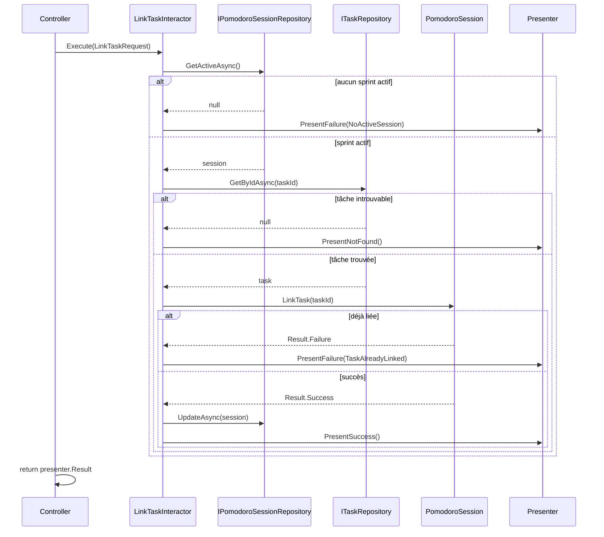
```mermaid
sequenceDiagram
    participant C as Controller
    participant I as LinkTaskInteractor
    participant SR as IPomodoroSessionRepository
    participant TR as ITaskRepository
    participant S as PomodoroSession
    participant P as Presenter

    C->>I: Execute(LinkTaskRequest)
    I->>SR: GetActiveAsync()
    alt aucun sprint actif
        SR-->>I: null
        I->>P: PresentFailure(NoActiveSession)
    else sprint actif
        SR-->>I: session
        I->>TR: GetByIdAsync(taskId)
        alt tâche introuvable
            TR-->>I: null
            I->>P: PresentNotFound()
        else tâche trouvée
            TR-->>I: task
            I->>S: LinkTask(taskId)
            alt déjà liée
                S-->>I: Result.Failure
                I->>P: PresentFailure(TaskAlreadyLinked)
            else succès
                S-->>I: Result.Success
                I->>SR: UpdateAsync(session)
                I->>P: PresentSuccess()
            end
        end
    end
    C->>C: return presenter.Result
```

**Scénarios d'exception :**
- E1 : aucun sprint actif → erreur.
- E2 : tâche introuvable → `NotFound`.
- E3 : tâche déjà liée → erreur métier.

**Critères d'acceptance :**
- [ ] `TaskId` présent dans `LinkedTaskIds` après liaison
- [ ] Liaison dupliquée rejetée
- [ ] Tâche inexistante → rejetée

---

### UC-08 — Mettre à jour le statut d'une tâche depuis le sprint

**Acteur principal :** Développeur
**Parties prenantes :** —
**Préconditions :** sprint `Active`, tâche liée au sprint.
**Postconditions (succès) :** statut de la tâche mis à jour (`InProgress` ou `Done`).

**Scénario nominal :**
1. Le développeur choisit une tâche liée et le nouveau statut.
2. Le système vérifie qu'un sprint est actif.
3. Le système vérifie que la tâche est liée au sprint.
4. Le système met à jour le statut de la tâche.

**Scénarios alternatifs :** —

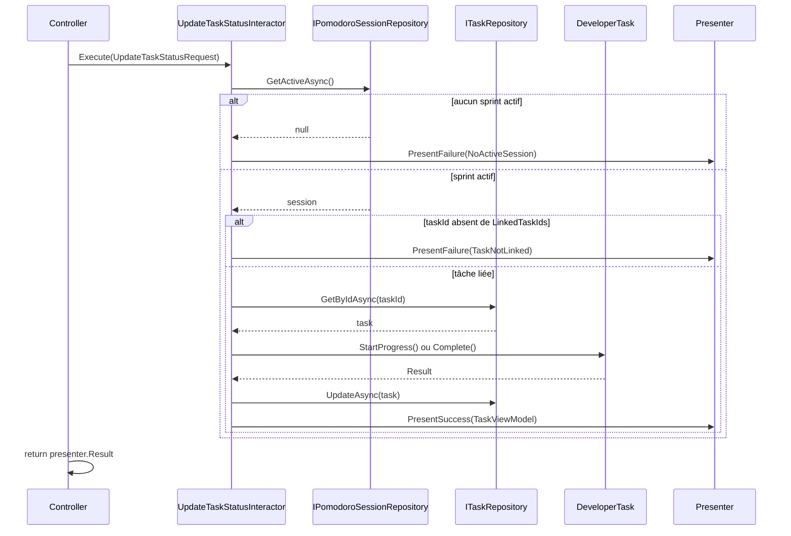
```mermaid
sequenceDiagram
    participant C as Controller
    participant I as UpdateTaskStatusInteractor
    participant SR as IPomodoroSessionRepository
    participant TR as ITaskRepository
    participant T as DeveloperTask
    participant P as Presenter

    C->>I: Execute(UpdateTaskStatusRequest)
    I->>SR: GetActiveAsync()
    alt aucun sprint actif
        SR-->>I: null
        I->>P: PresentFailure(NoActiveSession)
    else sprint actif
        SR-->>I: session
        alt taskId absent de LinkedTaskIds
            I->>P: PresentFailure(TaskNotLinked)
        else tâche liée
            I->>TR: GetByIdAsync(taskId)
            TR-->>I: task
            I->>T: StartProgress() ou Complete()
            T-->>I: Result
            I->>TR: UpdateAsync(task)
            I->>P: PresentSuccess(TaskViewModel)
        end
    end
    C->>C: return presenter.Result
```

**Scénarios d'exception :**
- E1 : aucun sprint actif → erreur.
- E2 : tâche non liée au sprint → erreur.
- E3 : transition invalide (ex. `Done → InProgress`) → erreur métier.

**Critères d'acceptance :**
- [ ] `Pending → InProgress` accepté
- [ ] `InProgress → Done` accepté
- [ ] Rétrogradation depuis `Done` rejetée
- [ ] Tâche non liée au sprint → rejetée

---

### UC-09 — Créer une tâche pendant un sprint

**Acteur principal :** Développeur
**Parties prenantes :** —
**Préconditions :** sprint `Active`.
**Postconditions (succès) :** tâche créée (`Pending`), automatiquement liée au sprint actif.

**Scénario nominal :**
1. Le développeur saisit un titre de tâche depuis l'écran du sprint.
2. Le système vérifie qu'un sprint est actif.
3. Le système valide le titre.
4. Le système crée la tâche et la lie au sprint.

**Scénarios alternatifs :** —

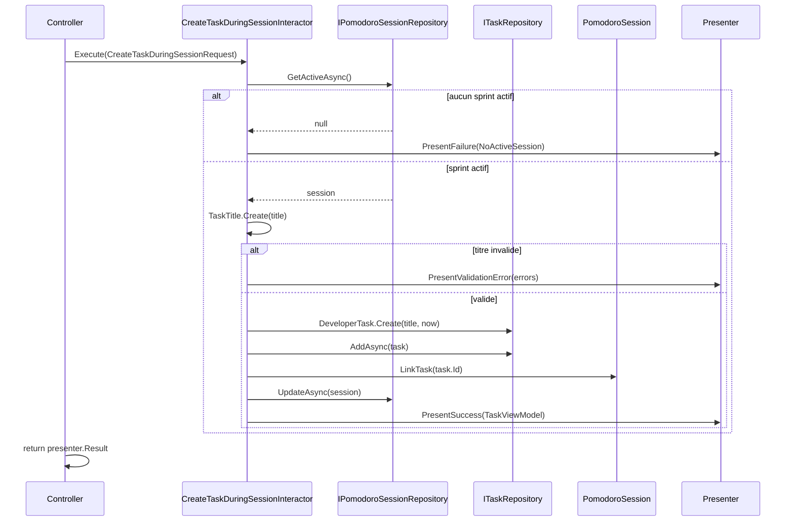
```mermaid
sequenceDiagram
    participant C as Controller
    participant I as CreateTaskDuringSessionInteractor
    participant SR as IPomodoroSessionRepository
    participant TR as ITaskRepository
    participant S as PomodoroSession
    participant P as Presenter

    C->>I: Execute(CreateTaskDuringSessionRequest)
    I->>SR: GetActiveAsync()
    alt aucun sprint actif
        SR-->>I: null
        I->>P: PresentFailure(NoActiveSession)
    else sprint actif
        SR-->>I: session
        I->>I: TaskTitle.Create(title)
        alt titre invalide
            I->>P: PresentValidationError(errors)
        else valide
            I->>TR: DeveloperTask.Create(title, now)
            I->>TR: AddAsync(task)
            I->>S: LinkTask(task.Id)
            I->>SR: UpdateAsync(session)
            I->>P: PresentSuccess(TaskViewModel)
        end
    end
    C->>C: return presenter.Result
```

**Scénarios d'exception :**
- E1 : aucun sprint actif → erreur.
- E2 : titre vide ou > 200 caractères → erreur de validation.

**Critères d'acceptance :**
- [ ] Tâche créée dans le BC Tasks avec statut `Pending`
- [ ] `TaskId` présent dans `LinkedTaskIds` du sprint
- [ ] Sprint non actif → rejeté

---

### UC-10 — Interrompre un sprint

**Acteur principal :** Développeur
**Parties prenantes :** —
**Préconditions :** sprint `Active`.
**Postconditions (succès) :** session passe à `Interrupted`, `EndedAt` renseigné, aucune pause lancée.

**Scénario nominal :**
1. Le développeur demande l'interruption du sprint en cours.
2. Le système vérifie qu'un sprint est actif.
3. Le système passe la session à `Interrupted` et enregistre `EndedAt`.

**Scénarios alternatifs :** —

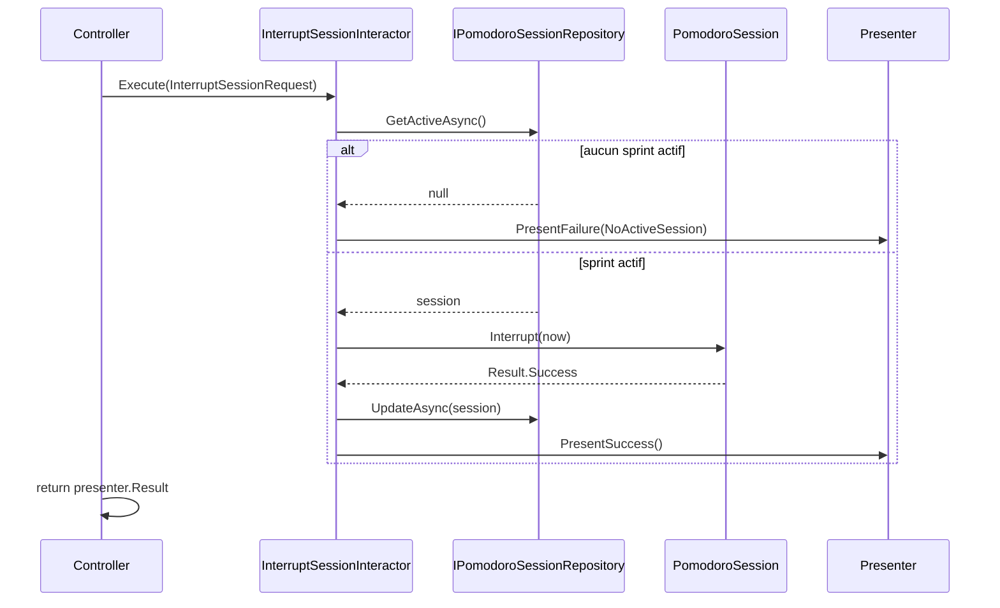
```mermaid
sequenceDiagram
    participant C as Controller
    participant I as InterruptSessionInteractor
    participant R as IPomodoroSessionRepository
    participant S as PomodoroSession
    participant P as Presenter

    C->>I: Execute(InterruptSessionRequest)
    I->>R: GetActiveAsync()
    alt aucun sprint actif
        R-->>I: null
        I->>P: PresentFailure(NoActiveSession)
    else sprint actif
        R-->>I: session
        I->>S: Interrupt(now)
        S-->>I: Result.Success
        I->>R: UpdateAsync(session)
        I->>P: PresentSuccess()
    end
    C->>C: return presenter.Result
```

**Scénarios d'exception :**
- E1 : aucun sprint actif → erreur.

**Critères d'acceptance :**
- [ ] Statut `Interrupted`, `EndedAt` renseigné
- [ ] Aucune pause démarrée
- [ ] Sprint interrompu comptabilisé séparément des sprints complétés

---

### UC-11 — Terminer un sprint

**Acteur principal :** Système (UI Blazor — chrono à zéro)
**Parties prenantes :** Développeur (reçoit le signal de pause)
**Préconditions :** sprint `Active`.
**Postconditions (succès) :** session `Completed`, `EndedAt` renseigné, type de pause calculé et retourné.

**Scénario nominal :**
1. Le chrono UI atteint zéro.
2. L'UI appelle l'endpoint de complétion.
3. Le système vérifie qu'un sprint est actif.
4. Le système passe la session à `Completed` et enregistre `EndedAt`.
5. Le système compte les sprints complétés aujourd'hui.
6. Le système retourne le type de pause (courte ou longue) et sa durée.

**Scénarios alternatifs :**
- A1 : `count % 4 == 0` → pause longue. Sinon → pause courte.

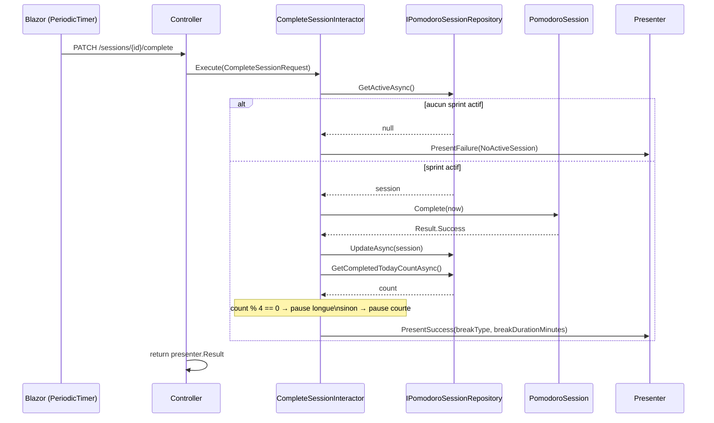
```mermaid
sequenceDiagram
    participant UI as Blazor (PeriodicTimer)
    participant C as Controller
    participant I as CompleteSessionInteractor
    participant R as IPomodoroSessionRepository
    participant S as PomodoroSession
    participant P as Presenter

    UI->>C: PATCH /sessions/{id}/complete
    C->>I: Execute(CompleteSessionRequest)
    I->>R: GetActiveAsync()
    alt aucun sprint actif
        R-->>I: null
        I->>P: PresentFailure(NoActiveSession)
    else sprint actif
        R-->>I: session
        I->>S: Complete(now)
        S-->>I: Result.Success
        I->>R: UpdateAsync(session)
        I->>R: GetCompletedTodayCountAsync()
        R-->>I: count
        note over I: count % 4 == 0 → pause longue\nsinon → pause courte
        I->>P: PresentSuccess(breakType, breakDurationMinutes)
    end
    C->>C: return presenter.Result
```

**Scénarios d'exception :**
- E1 : aucun sprint actif (incohérence UI) → erreur ignorée côté UI.

**Critères d'acceptance :**
- [ ] Statut `Completed`, `EndedAt` renseigné
- [ ] Après 4 complétés → pause longue, sinon pause courte
- [ ] Durée de pause = valeur configurée correspondante
- [ ] Le compteur ne tient compte que des sessions `Completed` du jour courant

---

## Bounded Context : Journal (à venir)

> Use cases à détailler lors de l'itération concernée.

**Concept clé :** log d'activité quotidien généré automatiquement à partir des sprints Pomodoro et des tâches. Répond à la question *"qu'est-ce que j'ai fait aujourd'hui ?"*.

---

## Bounded Context : Tickets (à venir)

> Use cases à détailler lors de l'itération concernée.

---

## ADR (Architecture Decision Records)

### ADR-001 — Clean Architecture + boundary pattern
- **Contexte :** Besoin d'une base solide, évolutive, testable, multi-UI (Web + MAUI).
- **Décision :** Couches Domain / Application / Adapters / Infrastructure. Boundary pattern complet : chaque Use Case expose un `IInputBoundary` et un `IOutputBoundary`. L'Interactor ne retourne rien — il pousse le résultat via le presenter.
- **Conséquences :** Use Cases indépendants de l'UI et de la persistance. Ajout Web/MAUI sans toucher au Domain.

### ADR-002 — SQLite via EF Core (fichier local)
- **Contexte :** Première itération, zéro infrastructure.
- **Décision :** SQLite + EF Core, fichier `kairudev.db` exclu du git. `ITaskRepository` dans Domain, implémentation dans Infrastructure.
- **Conséquences :** Swap PostgreSQL = nouvelle implémentation, aucun impact sur Domain/Application.

### ADR-003 — .NET 10 preview
- **Contexte :** Choix imposé.
- **Décision :** Cible `net10.0`. Warning `NETSDK1057` non bloquant.
- **Conséquences :** À surveiller lors du passage en release.

### ADR-004 — Controllers composent les Interactors
- **Contexte :** Le presenter HTTP est spécifique à chaque requête.
- **Décision :** Le Controller instancie le presenter et l'Interactor à chaque action, avec `ITaskRepository` injecté via DI.
- **Conséquences :** Composition explicite, pas de factory supplémentaire.

### ADR-005 — Blazor WebAssembly standalone
- **Contexte :** Cible multi-UI, partage futur de composants avec MAUI via Blazor Hybrid.
- **Décision :** Blazor WASM standalone, communication uniquement via API REST. `TaskDto` défini dans le projet Web.
- **Conséquences :** Projet Web totalement découplé du backend.

### ADR-006 — Timer côté client
- **Contexte :** La fin de sprint doit être automatique ; pas d'infrastructure serveur temps-réel.
- **Décision :** Le chrono tourne dans Blazor WASM (`PeriodicTimer` C#). À zéro, le client appelle `PATCH /api/pomodoro/sessions/{id}/complete`. Le serveur ne maintient aucun état de chrono.
- **Conséquences :** Architecture simple, sans WebSocket ni SignalR. Si l'onglet est fermé pendant un sprint, la session reste `Active` — acceptable pour v1.

### ADR-007 — Fusion Adapters dans Application
- **Contexte :** Le projet `Kairudev.Adapters` ne contient que des presenters génériques peu utilisés ; les presenters HTTP vivent déjà dans `Kairudev.Api`.
- **Décision :** À partir du BC Pomodoro, `Kairudev.Adapters` est supprimé. Les ViewModels et les presenters non-HTTP vivent dans `Kairudev.Application`. Les presenters HTTP restent dans `Kairudev.Api`.
- **Conséquences :** Solution simplifiée (un projet de moins). Le BC Tasks sera refactorisé en dette technique.

### ADR-008 — .NET MAUI avec Blazor Hybrid et duplication temporaire
- **Contexte :** Besoin d'une application native desktop/mobile sans refactoring majeur du code Blazor existant.
- **Décision :** Créer `Kairudev.Maui` avec `Microsoft.AspNetCore.Components.WebView.Maui`. Copier les pages Blazor (Tasks, Pomodoro, Journal, Settings) et les services API clients dans le projet MAUI. Communication uniquement via API REST (même URL que Blazor WASM). Aucune référence aux projets Domain/Application/Infrastructure.
- **Conséquences :**
  - **Avantage** : application native fonctionnelle immédiatement, réutilisation totale de l'UI Blazor.
  - **Dette technique** : duplication de code (pages + services). Solution future : extraire dans une Razor Class Library `Kairudev.Web.Shared` référencée par Web + MAUI.
  - **Clean Architecture respectée** : MAUI reste un pur adapter, le Domain ignore tout de l'UI.

---

## Bounded Context : Settings

### UC-17 — Sauvegarder préférence de thème

**Acteur principal :** Développeur  
**Parties prenantes :** —  
**Préconditions :** —  
**Postconditions (succès) :** La préférence de thème est sauvegardée et le thème est appliqué.

**Scénario nominal :**
1. Le développeur accède aux paramètres.
2. Le développeur sélectionne un thème (Clair / Sombre / Système).
3. Le système valide la valeur (Light, Dark, System).
4. Le système met à jour l'aggregate UserSettings.
5. Le système persiste en base SQLite.
6. Le système applique le thème immédiatement (via JSInterop).

**Scénarios d'exception :**
- **E1 :** Valeur invalide → erreur retournée à l'UI.

**Critères d'acceptance :**
- [x] La préférence est persistée en SQLite
- [x] Le changement est appliqué immédiatement sans rechargement
- [x] Synchronisation Web ↔ MAUI via API
- [x] Détection de la préférence système (dark/light)

---

### UC-18 — Consulter les paramètres utilisateur

**Acteur principal :** Développeur  
**Parties prenantes :** —  
**Préconditions :** —  
**Postconditions (succès) :** Les paramètres sont affichés.

**Scénario nominal :**
1. Le développeur accède à /settings.
2. Le système récupère les UserSettings depuis SQLite.
3. Le système retourne le ThemePreference.
4. L'UI affiche la valeur actuelle dans le select.

**Scénarios alternatifs :**
- **A1 :** Aucun paramètre n'existe → crée des settings par défaut (System).

**Critères d'acceptance :**
- [x] Chargement des settings au démarrage de la page
- [x] Création automatique si premier accès

