# Kairudev — Spécification fonctionnelle et architecturale

## Vision produit
Application de gestion d'activité quotidienne pour développeurs.
Elle centralise en un seul endroit tout ce dont un développeur a besoin pour rester focus et organisé :
todo list de micro-tâches, journal de bord, sessions Pomodoro.

### Itération #19 — Retrait Jira (pages + configuration UI)

**Objectif :** désactiver Jira côté expérience utilisateur sans supprimer le BC Tickets côté backend/domain.

**Périmètre :**
- suppression des pages Tickets Web/MAUI ;
- suppression de l'entrée Tickets dans les menus Web/MAUI ;
- suppression de la configuration Jira dans Settings Web/MAUI ;
- suppression de l'endpoint API `PUT /api/settings/jira` ;
- retrait des actions de liaison Jira depuis les pages Tasks Web/MAUI.

**Hors périmètre :**
- suppression des composants Domain/Application/Infrastructure liés à Jira ;
- migration de base de données.

---

## Acteurs

| Acteur | Description |
|---|---|
| **Développeur** | Utilisateur authentifié via GitHub OAuth, peut être plusieurs sur la même instance |
| **Système** | Actions automatiques déclenchées par l'application (génération entrées journal, etc.) |

---

## Vue d'ensemble — Cas d'utilisation

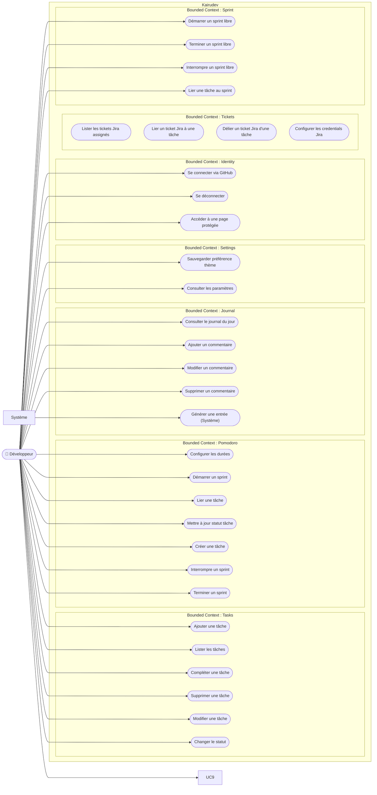
```mermaid
flowchart LR
    Dev(["👤 Développeur"])

    subgraph Kairudev["Kairudev"]
        subgraph Tasks["Bounded Context : Tasks"]
            UC1(["Ajouter une tâche"])
            UC2(["Lister les tâches"])
            UC3(["Compléter une tâche"])
            UC4(["Supprimer une tâche"])
            UC5(["Modifier une tâche"])
            UC12(["Changer le statut"])
        end

        subgraph Pomodoro["Bounded Context : Pomodoro"]
            P05(["Configurer les durées"])
            P06(["Démarrer un sprint"])
            P07(["Lier une tâche"])
            P08(["Mettre à jour statut tâche"])
            P09(["Créer une tâche"])
            P10(["Interrompre un sprint"])
            P11(["Terminer un sprint"])
        end

        subgraph Journal["Bounded Context : Journal"]
            UC13(["Consulter le journal du jour"])
            UC14(["Ajouter un commentaire"])
            UC15(["Modifier un commentaire"])
            UC16(["Supprimer un commentaire"])
            UCS1(["Générer une entrée (Système)"])
        end

        subgraph Settings["Bounded Context : Settings"]
            UC17(["Sauvegarder préférence thème"])
            UC18(["Consulter les paramètres"])
        end

        subgraph Tickets["Bounded Context : Tickets"]
            UCT1(["Lister les tickets Jira assignés"])
            UCT2(["Lier un ticket Jira à une tâche"])
            UCT3(["Délier un ticket Jira d'une tâche"])
            UCT4(["Configurer les credentials Jira"])
        end

        subgraph Identity["Bounded Context : Identity"]
            UCA1(["Se connecter via GitHub"])
            UCA2(["Se déconnecter"])
            UCA3(["Accéder à une page protégée"])
        end

        subgraph SprintBC["Bounded Context : Sprint"]
            SP01(["Démarrer un sprint libre"])
            SP02(["Terminer un sprint libre"])
            SP03(["Interrompre un sprint libre"])
            SP04(["Lier une tâche au sprint"])
        end
    end

    Dev --> UC1
    Dev --> UC2
    Dev --> UC3
    Dev --> UC4
    Dev --> UC5
    Dev --> UC12
    Dev --> P05
    Dev --> P06
    Dev --> P07
    Dev --> P08
    Dev --> P09
    Dev --> P10
    Dev --> P11
    Dev --> UC13
    Dev --> UC14
    Dev --> UC15
    Dev --> UC16
    Dev --> UC17
    Dev --> UC18
    Système --> UCS1
    Dev --> UC9
    Dev --> UCA1
    Dev --> UCA2
    Dev --> UCA3
    Dev --> SP01
    Dev --> SP02
    Dev --> SP03
    Dev --> SP04
```

---

## Architecture cible

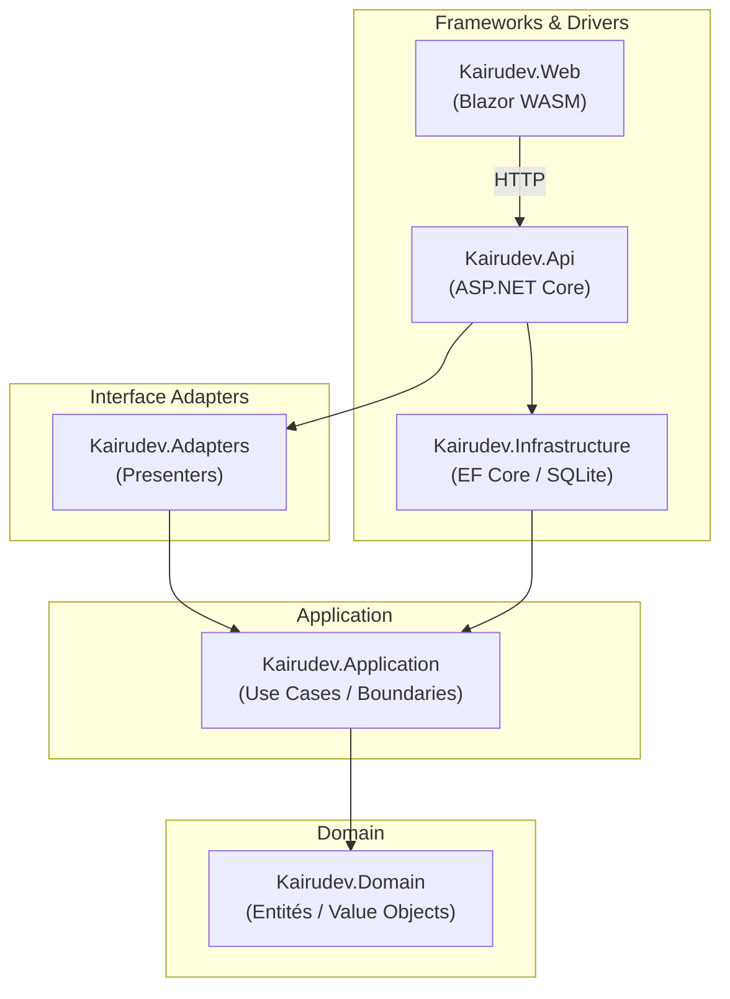
```mermaid
flowchart TB
    subgraph Ext["Frameworks & Drivers"]
        Web["Kairudev.Web\n(Blazor WASM)"]
        API["Kairudev.Api\n(ASP.NET Core)"]
        Infra["Kairudev.Infrastructure\n(EF Core / SQLite)"]
    end

    subgraph Adp["Interface Adapters"]
        A["Kairudev.Adapters\n(Presenters)"]
    end

    subgraph App["Application"]
        UC["Kairudev.Application\n(Use Cases / Boundaries)"]
    end

    subgraph Dom["Domain"]
        D["Kairudev.Domain\n(Entités / Value Objects)"]
    end

    Web -->|HTTP| API
    API --> A
    API --> Infra
    A --> UC
    Infra --> UC
    UC --> D
```

> La règle fondamentale : les dépendances pointent uniquement vers l'intérieur.
> Le Domain ne connaît rien de ce qui l'entoure.

---

## Bounded Context : Tasks

### Modèle du domaine

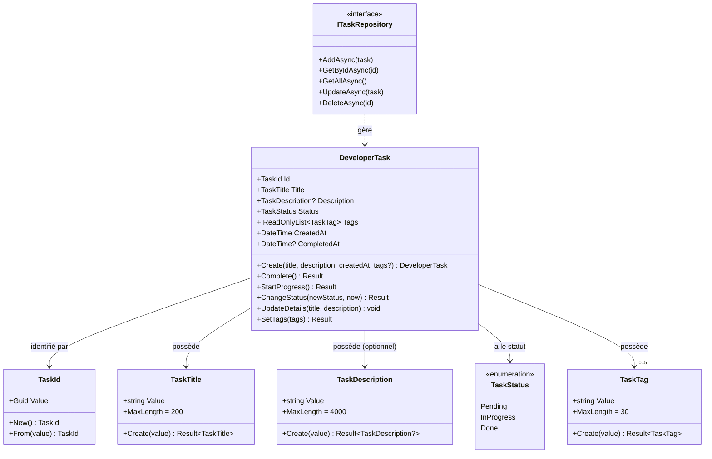
```mermaid
classDiagram
    class DeveloperTask {
        +TaskId Id
        +TaskTitle Title
        +TaskDescription? Description
        +TaskStatus Status
        +IReadOnlyList~TaskTag~ Tags
        +DateTime CreatedAt
        +DateTime? CompletedAt
        +Create(title, description, createdAt, tags?) DeveloperTask
        +Complete() Result
        +StartProgress() Result
        +ChangeStatus(newStatus, now) Result
        +UpdateDetails(title, description) void
        +SetTags(tags) Result
    }

    class TaskId {
        +Guid Value
        +New() TaskId
        +From(value) TaskId
    }

    class TaskTitle {
        +string Value
        +MaxLength = 200
        +Create(value) Result~TaskTitle~
    }

    class TaskDescription {
        +string Value
        +MaxLength = 4000
        +Create(value) Result~TaskDescription?~
    }

    class TaskStatus {
        <<enumeration>>
        Pending
        InProgress
        Done
    }

    class TaskTag {
        +string Value
        +MaxLength = 30
        +Create(value) Result~TaskTag~
    }

    class ITaskRepository {
        <<interface>>
        +AddAsync(task)
        +GetByIdAsync(id)
        +GetAllAsync()
        +UpdateAsync(task)
        +DeleteAsync(id)
    }

    DeveloperTask --> TaskId : identifié par
    DeveloperTask --> TaskTitle : possède
    DeveloperTask --> TaskDescription : possède (optionnel)
    DeveloperTask --> TaskStatus : a le statut
    DeveloperTask --> "0..5" TaskTag : possède
    ITaskRepository ..> DeveloperTask : gère
```

---

### UC-01 — Ajouter une tâche

**Acteur principal :** Développeur
**Parties prenantes :** —
**Préconditions :** —
**Postconditions (succès) :** une tâche est créée avec le statut `Pending`, persistée, et retournée.

**Scénario nominal :**
1. Le développeur saisit un titre de tâche.
2. Le système valide le titre (non vide, ≤ 200 caractères).
3. Le système crée la tâche avec un identifiant unique, le statut `Pending` et la date de création.
4. Le système persiste la tâche.
5. Le système retourne la tâche créée.

**Scénarios alternatifs :** —

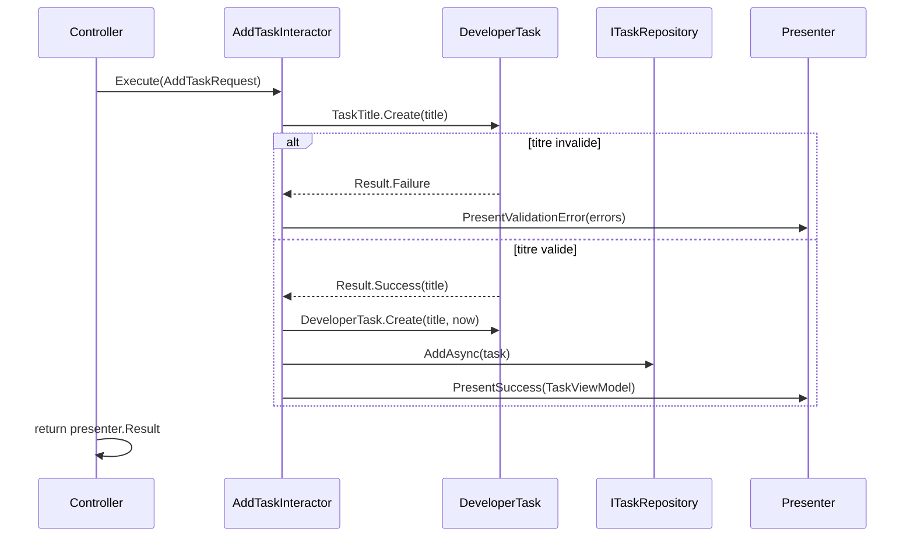
```mermaid
sequenceDiagram
    participant C as Controller
    participant I as AddTaskInteractor
    participant T as DeveloperTask
    participant R as ITaskRepository
    participant P as Presenter

    C->>I: Execute(AddTaskRequest)
    I->>T: TaskTitle.Create(title)
    alt titre invalide
        T-->>I: Result.Failure
        I->>P: PresentValidationError(errors)
    else titre valide
        T-->>I: Result.Success(title)
        I->>T: DeveloperTask.Create(title, now)
        I->>R: AddAsync(task)
        I->>P: PresentSuccess(TaskViewModel)
    end
    C->>C: return presenter.Result
```

**Scénarios d'exception :**
- E1 : titre vide ou composé uniquement d'espaces → erreur de validation, aucune tâche créée.
- E2 : titre supérieur à 200 caractères → erreur de validation, aucune tâche créée.

**Critères d'acceptance :**
- [x] Une tâche créée a le statut `Pending`
- [x] L'identifiant est unique (UUID)
- [x] Le titre est trimé des espaces en début et fin
- [x] Titre vide → rejeté
- [x] Titre > 200 caractères → rejeté

---

### UC-02 — Lister les tâches

**Acteur principal :** Développeur
**Parties prenantes :** —
**Préconditions :** —
**Postconditions (succès) :** la liste complète des tâches est retournée, ordonnée par date de création.

**Scénario nominal :**
1. Le développeur demande la liste des tâches.
2. Le système récupère toutes les tâches persistées.
3. Le système retourne les tâches triées par date de création (plus ancienne en premier).

**Scénarios alternatifs :**
- A1 : aucune tâche existante → le système retourne une liste vide.

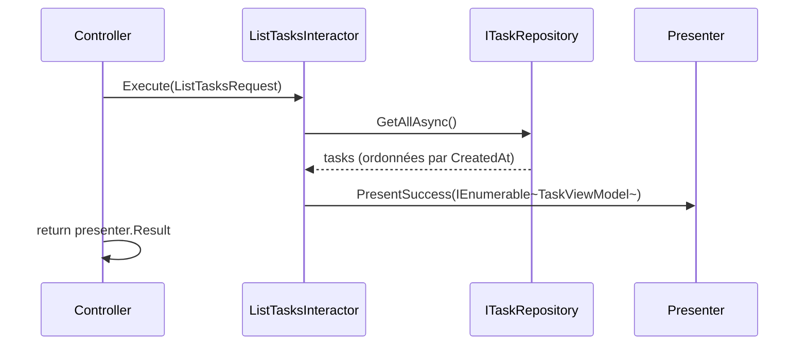
```mermaid
sequenceDiagram
    participant C as Controller
    participant I as ListTasksInteractor
    participant R as ITaskRepository
    participant P as Presenter

    C->>I: Execute(ListTasksRequest)
    I->>R: GetAllAsync()
    R-->>I: tasks (ordonnées par CreatedAt)
    I->>P: PresentSuccess(IEnumerable~TaskViewModel~)
    C->>C: return presenter.Result
```

**Scénarios d'exception :** —

**Critères d'acceptance :**
- [x] La liste est ordonnée par `CreatedAt` croissant
- [x] Une liste vide est un résultat valide (pas une erreur)

---

### UC-03 — Compléter une tâche

**Acteur principal :** Développeur
**Parties prenantes :** —
**Préconditions :** la tâche identifiée existe.
**Postconditions (succès) :** la tâche passe au statut `Done`, la date de complétion est enregistrée.

**Scénario nominal :**
1. Le développeur désigne une tâche à compléter (par son identifiant).
2. Le système vérifie que la tâche existe.
3. Le système vérifie que la tâche n'est pas déjà terminée.
4. Le système passe la tâche au statut `Done` et enregistre la date de complétion.
5. Le système persiste la modification.

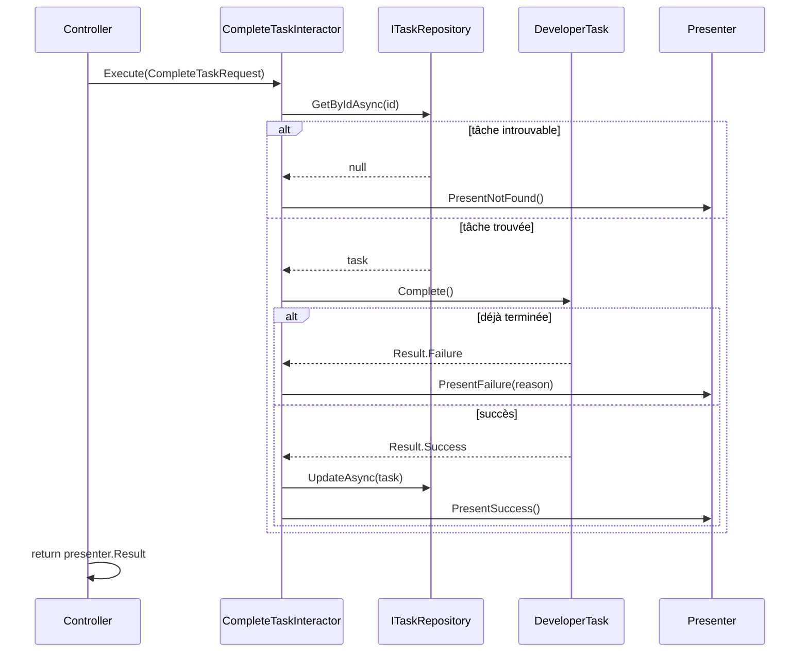
```mermaid
sequenceDiagram
    participant C as Controller
    participant I as CompleteTaskInteractor
    participant R as ITaskRepository
    participant T as DeveloperTask
    participant P as Presenter

    C->>I: Execute(CompleteTaskRequest)
    I->>R: GetByIdAsync(id)
    alt tâche introuvable
        R-->>I: null
        I->>P: PresentNotFound()
    else tâche trouvée
        R-->>I: task
        I->>T: Complete()
        alt déjà terminée
            T-->>I: Result.Failure
            I->>P: PresentFailure(reason)
        else succès
            T-->>I: Result.Success
            I->>R: UpdateAsync(task)
            I->>P: PresentSuccess()
        end
    end
    C->>C: return presenter.Result
```

**Scénarios d'exception :**
- E1 : tâche introuvable → erreur `NotFound`.
- E2 : tâche déjà au statut `Done` → erreur métier.

**Critères d'acceptance :**
- [x] Une tâche complétée a le statut `Done`
- [x] `CompletedAt` est renseignée
- [x] Compléter une tâche déjà `Done` est rejeté
- [x] Identifiant inexistant → `NotFound`

---

### UC-04 — Supprimer une tâche

**Acteur principal :** Développeur
**Parties prenantes :** —
**Préconditions :** la tâche identifiée existe.
**Postconditions (succès) :** la tâche est supprimée de la persistance.

**Scénario nominal :**
1. Le développeur désigne une tâche à supprimer (par son identifiant).
2. Le système vérifie que la tâche existe.
3. Le système supprime la tâche.

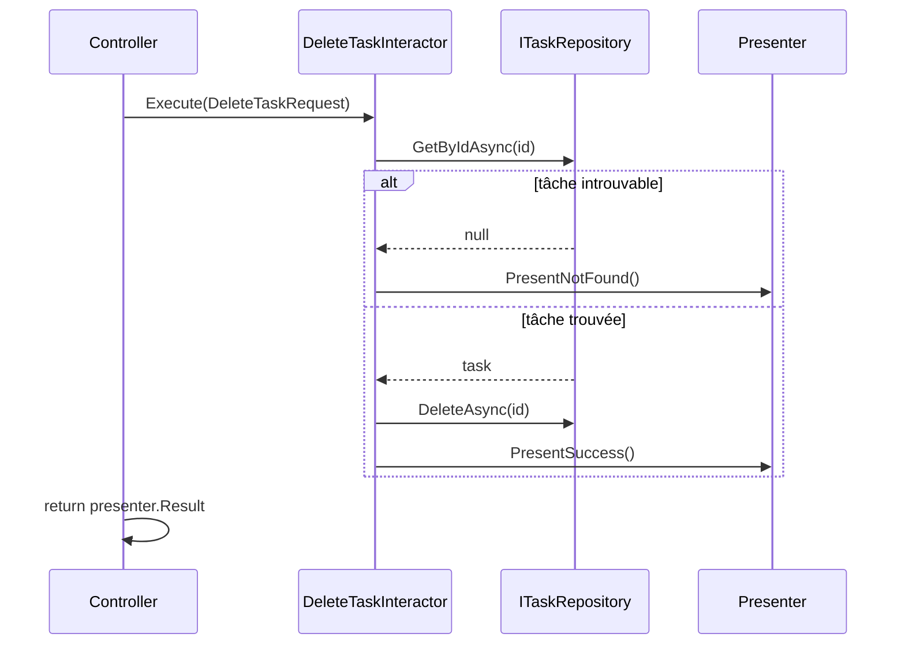
```mermaid
sequenceDiagram
    participant C as Controller
    participant I as DeleteTaskInteractor
    participant R as ITaskRepository
    participant P as Presenter

    C->>I: Execute(DeleteTaskRequest)
    I->>R: GetByIdAsync(id)
    alt tâche introuvable
        R-->>I: null
        I->>P: PresentNotFound()
    else tâche trouvée
        R-->>I: task
        I->>R: DeleteAsync(id)
        I->>P: PresentSuccess()
    end
    C->>C: return presenter.Result
```

**Scénarios d'exception :**
- E1 : tâche introuvable → erreur `NotFound`.

**Critères d'acceptance :**
- [x] La tâche n'existe plus après suppression
- [x] Identifiant inexistant → `NotFound`

### UC-12 — Changer le statut d'une tâche

**Acteur principal :** Développeur
**Parties prenantes :** —
**Préconditions :** la tâche identifiée existe.
**Postconditions (succès) :** le statut est mis à jour, `CompletedAt` ajusté, modification persistée.

**Scénario nominal :**
1. Le développeur désigne une tâche (par id) et le nouveau statut souhaité.
2. Le système vérifie que la valeur de statut est reconnue (`Pending`, `InProgress`, `Done`).
3. Le système vérifie que la tâche existe.
4. Le système vérifie que le nouveau statut est différent du statut actuel.
5. Le système applique la transition.
6. Si `→ Done` : `CompletedAt = now`. Si `Done →` autre : `CompletedAt = null`.
7. Le système persiste la modification et retourne la tâche mise à jour.

**Scénarios d'exception :**
- E1 : valeur de statut non reconnue → `400 Bad Request`.
- E2 : tâche introuvable → `404 Not Found`.
- E3 : statut identique au statut actuel → `409 Conflict` (erreur métier `SameStatus`).

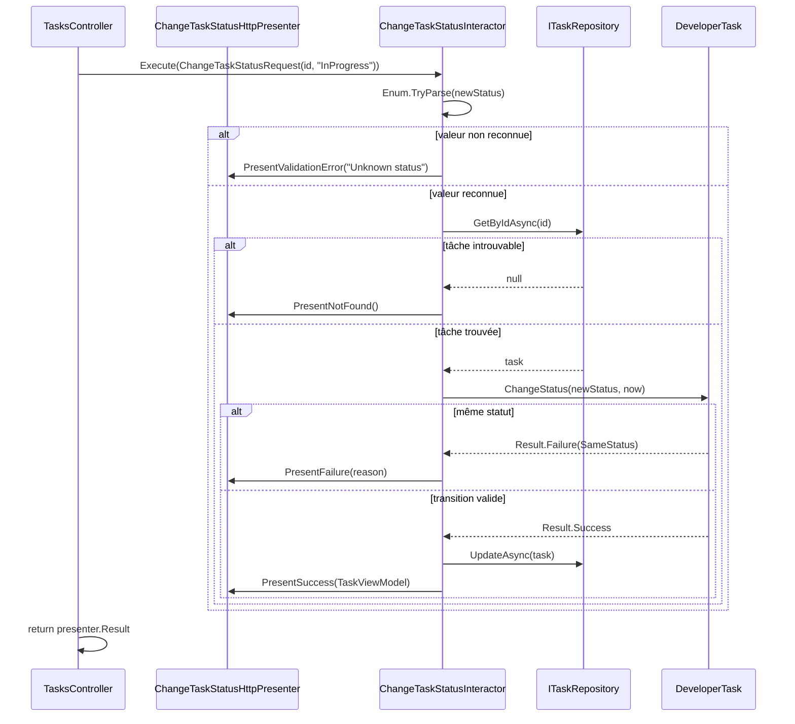
```mermaid
sequenceDiagram
    participant C as TasksController
    participant P as ChangeTaskStatusHttpPresenter
    participant I as ChangeTaskStatusInteractor
    participant R as ITaskRepository
    participant T as DeveloperTask

    C->>I: Execute(ChangeTaskStatusRequest(id, "InProgress"))
    I->>I: Enum.TryParse(newStatus)
    alt valeur non reconnue
        I->>P: PresentValidationError("Unknown status")
    else valeur reconnue
        I->>R: GetByIdAsync(id)
        alt tâche introuvable
            R-->>I: null
            I->>P: PresentNotFound()
        else tâche trouvée
            R-->>I: task
            I->>T: ChangeStatus(newStatus, now)
            alt même statut
                T-->>I: Result.Failure(SameStatus)
                I->>P: PresentFailure(reason)
            else transition valide
                T-->>I: Result.Success
                I->>R: UpdateAsync(task)
                I->>P: PresentSuccess(TaskViewModel)
            end
        end
    end
    C->>C: return presenter.Result
```

**Critères d'acceptance :**
- [x] Les 6 transitions valides acceptées (`Pending ↔ InProgress ↔ Done`)
- [x] `* → Done` : `CompletedAt` renseigné
- [x] `Done → *` : `CompletedAt` remis à `null`
- [x] Transition identique → `409 Conflict` (`SameStatus`)
- [x] Tâche inexistante → `404 Not Found`
- [x] Valeur de statut non reconnue → `400 Bad Request`
- [x] Persistée et reflétée dans `ListTasks`

---

### UC-05 — Modifier une tâche

**Acteur principal :** Développeur  
**Parties prenantes :** —  
**Préconditions :** la tâche identifiée existe.  
**Postconditions (succès) :** le titre et/ou la description sont mis à jour, modification persistée.

**Scénario nominal :**
1. Le développeur désigne une tâche (par id) et fournit un nouveau titre et/ou une nouvelle description.
2. Le système vérifie que la tâche existe.
3. Le système valide le titre (non vide, ≤ 200 caractères).
4. Le système valide la description (≤ 1000 caractères, optionnelle).
5. Le système met à jour le titre et la description de la tâche.
6. Le système persiste la modification et retourne la tâche mise à jour.

**Scénarios d'exception :**
- E1 : tâche introuvable → `404 Not Found`.
- E2 : titre vide → `400 Bad Request` (erreur de validation).
- E3 : titre > 200 caractères → `400 Bad Request` (erreur de validation).
- E4 : description > 1000 caractères → `400 Bad Request` (erreur de validation).

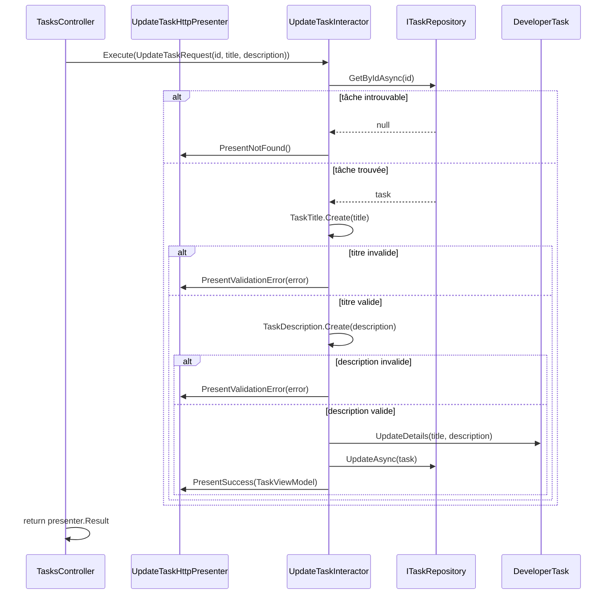
```mermaid
sequenceDiagram
    participant C as TasksController
    participant P as UpdateTaskHttpPresenter
    participant I as UpdateTaskInteractor
    participant R as ITaskRepository
    participant T as DeveloperTask

    C->>I: Execute(UpdateTaskRequest(id, title, description))
    I->>R: GetByIdAsync(id)
    alt tâche introuvable
        R-->>I: null
        I->>P: PresentNotFound()
    else tâche trouvée
        R-->>I: task
        I->>I: TaskTitle.Create(title)
        alt titre invalide
            I->>P: PresentValidationError(error)
        else titre valide
            I->>I: TaskDescription.Create(description)
            alt description invalide
                I->>P: PresentValidationError(error)
            else description valide
                I->>T: UpdateDetails(title, description)
                I->>R: UpdateAsync(task)
                I->>P: PresentSuccess(TaskViewModel)
            end
        end
    end
    C->>C: return presenter.Result
```

**Critères d'acceptance :**
- [x] Le titre peut être modifié
- [x] La description peut être ajoutée, modifiée ou supprimée (null)
- [x] Titre vide → `400 Bad Request`
- [x] Titre > 200 caractères → `400 Bad Request`
- [x] Description > 4000 caractères → `400 Bad Request` *(limite portée de 1000 → 4000, itération #18)*
- [x] Tâche inexistante → `404 Not Found`
- [x] Modification persistée et reflétée dans `ListTasks`

---

### UC-T-13 — Éditeur Markdown pour la description d'une tâche

**Acteur principal :** Développeur
**Parties prenantes :** —
**Préconditions :** la tâche existe ; l'utilisateur a ouvert le panneau de détail de la tâche
**Postconditions (succès) :** la description Markdown est persistée ; le rendu HTML est affiché dans le panneau de détail

**Scénario nominal :**
1. Le développeur clique sur une tâche dans la liste.
2. Le système ouvre le panneau de détail et affiche :
   - Le titre de la tâche (texte brut)
   - La description rendue en HTML via Markdig (ou un placeholder *"Aucune description"* si vide)
3. Le développeur clique sur **"Modifier"**.
4. Le système affiche l'éditeur Markdown en mode onglet `Éditer` actif, avec la description brute (Markdown source).
5. Le développeur saisit ou modifie le contenu Markdown.
6. Le développeur clique sur l'onglet `Prévisualiser`.
7. Le système rend le Markdown en HTML via Markdig et l'affiche dans le panneau de prévisualisation.
8. Le développeur clique sur **"Enregistrer"**.
9. Le système valide la description (≤ 5 000 caractères, optionnelle).
10. Le système persiste la description mise à jour.
11. Le système ferme l'éditeur et affiche le panneau de détail avec le rendu HTML mis à jour.

**Scénarios alternatifs :**
- **A1 — Description vide :** le développeur efface tout le contenu → description sauvegardée `null` ; panneau affiche *"Aucune description"*
- **A2 — Annulation :** clic sur "Annuler" → aucune modification, retour au panneau de détail
- **A3 — Bascule répétée :** le développeur peut alterner librement entre `Éditer` et `Prévisualiser` sans perdre le contenu

**Scénarios d'exception :**
- **E1 — Description > 5 000 caractères :** bouton "Enregistrer" désactivé ; compteur en rouge
- **E2 — Tâche supprimée entre-temps :** `404 Not Found` → message d'erreur, panneau fermé
- **E3 — Erreur réseau :** message d'erreur non bloquant, éditeur reste ouvert

**Contraintes techniques :**

| Élément | Décision |
|---|---|
| Librairie rendu | **Markdig** (NuGet, pure C#, sans JS interop) |
| Extensions activées | `UseAdvancedExtensions()` — tables, strikethrough, code blocks |
| Affichage rendu Blazor | `@((MarkupString)html)` |
| Limite description | Étendue de 1 000 → **5 000 caractères** (migration EF Core requise) |
| Sécurité | Markdig sanitise le HTML par défaut — pas d'injection XSS |

**Critères d'acceptance :**
- [ ] Le panneau de détail affiche la description rendue en HTML (gras, italique, listes, blocs de code)
- [ ] Si la description est vide → affiche *"Aucune description"*
- [ ] L'éditeur s'ouvre en onglet `Éditer` avec le Markdown source
- [ ] L'onglet `Prévisualiser` rend le Markdown via Markdig
- [ ] Compteur `X / 5 000 caractères` visible sous l'éditeur
- [ ] Dépassement → bouton "Enregistrer" désactivé, compteur en rouge
- [ ] "Annuler" ne modifie pas la description
- [ ] Description `null` si effacée complètement
- [ ] Aucune régression sur UC-05 (titre, statut)

---

### Itération #20 — Filtrage et tri des tâches

**Objectif :** Améliorer la page des tâches avec un tri par défaut (tâches ouvertes, les plus récentes en premier) et des filtres serveur (recherche par titre, filtre par statut).

**Périmètre :**
- Domain : évolution de `ITaskRepository.GetAllAsync` avec paramètres de filtrage
- Application : mise à jour de `ListTasksQuery` + `ListTasksQueryHandler` + ajout de `TaskStatusFilter`
- Infrastructure : mise à jour `EfCoreTaskRepository` (WHERE + ORDER BY côté DB)
- API : mise à jour `GET /api/tasks` avec query params `search` et `status`
- UI Web (Blazor WASM) : mise à jour `Tasks.razor` — champ recherche + dropdown statut
- UI MAUI (Blazor Hybrid) : même mise à jour

**Hors périmètre :**
- Tri personnalisé par l'utilisateur
- Pagination
- Migration EF Core (pas de nouveau champ en base)

#### UC-02 — Lister les tâches (révisé)

**Acteur principal :** Développeur
**Parties prenantes :** —
**Préconditions :** —
**Postconditions (succès) :** la liste des tâches est retournée selon les filtres actifs, triée par `CreatedAt` décroissant.

**Comportement par défaut (sans filtre) :**
- Affiche uniquement les tâches `Pending` et `InProgress` (statut ≠ `Done`)
- Triées par `CreatedAt` **décroissant** (les plus récentes en premier)

**Nouveaux paramètres de filtre :**

| Paramètre | Type | Valeur par défaut | Description |
|---|---|---|---|
| `SearchTerm` | `string?` | `null` | Recherche insensible à la casse dans le titre |
| `StatusFilter` | `TaskStatusFilter` | `OpenOnly` | Filtre de statut |

**`TaskStatusFilter` (enum Application layer) :**

| Valeur | Tâches retournées |
|---|---|
| `OpenOnly` | `Pending` + `InProgress` (défaut) |
| `All` | Tous les statuts |
| `Pending` | Uniquement `Pending` |
| `InProgress` | Uniquement `InProgress` |
| `Done` | Uniquement `Done` |

**Règles de combinaison :**
- `SearchTerm` et `StatusFilter` sont **indépendants** et **cumulatifs** (AND logique)
- Exemple : `SearchTerm="auth"` + `StatusFilter=Done` → tâches `Done` dont le titre contient "auth"

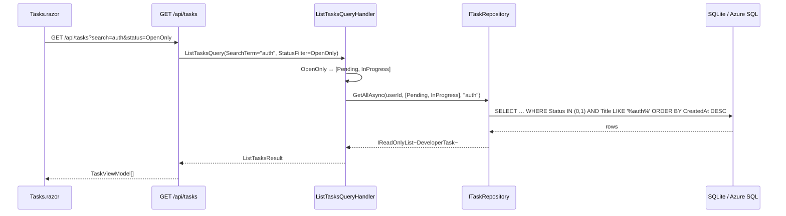
```mermaid
sequenceDiagram
    participant UI as Tasks.razor
    participant API as GET /api/tasks
    participant H as ListTasksQueryHandler
    participant R as ITaskRepository
    participant DB as SQLite / Azure SQL

    UI->>API: GET /api/tasks?search=auth&status=OpenOnly
    API->>H: ListTasksQuery(SearchTerm="auth", StatusFilter=OpenOnly)
    H->>H: OpenOnly → [Pending, InProgress]
    H->>R: GetAllAsync(userId, [Pending, InProgress], "auth")
    R->>DB: SELECT … WHERE Status IN (0,1) AND Title LIKE '%auth%' ORDER BY CreatedAt DESC
    DB-->>R: rows
    R-->>H: IReadOnlyList~DeveloperTask~
    H-->>API: ListTasksResult
    API-->>UI: TaskViewModel[]
```

**Scénarios alternatifs :**
- A1 : `StatusFilter=All` → toutes les tâches, quelque soit le statut
- A2 : `SearchTerm` vide ou null → aucun filtre texte appliqué
- A3 : aucune tâche ne correspond aux filtres → liste vide (pas une erreur), message contextuel

**Scénarios d'exception :** —

**Changements architecturaux :**

*Domain — `ITaskRepository` :*
```
GetAllAsync(UserId, TaskStatus[]? statuses = null, string? searchTerm = null, CancellationToken)
```
- `statuses = null` → aucun filtre statut (retourne tout)
- `searchTerm = null` → aucun filtre texte
- Tri : `CreatedAt DESC` systématique

*Application — `ListTasksQueryHandler` :*
- Traduit `TaskStatusFilter` → `TaskStatus[]` avant appel repository
  - `OpenOnly` → `[TaskStatus.Pending, TaskStatus.InProgress]`
  - `All` → `null` (pas de filtre)
  - Autres → `[TaskStatus.{valeur}]`

*Infrastructure — `EfCoreTaskRepository` :*
- Applique les filtres et le tri côté EF Core (SQL WHERE + ORDER BY)

*API — `GET /api/tasks` :*
- Query params : `?search=xxx&status=OpenOnly|All|Pending|InProgress|Done`
- Valeurs par défaut : `status=OpenOnly`, `search` absent

*UI — `Tasks.razor` (Web + MAUI) :*
- Champ de recherche : `<input>` avec rechargement déclenché à chaque modification (debounce 300 ms)
- Dropdown statut : "Ouvertes" / "Toutes" / "En attente" / "En cours" / "Terminées"
- Message contextuel quand la liste est vide selon le filtre actif

**Critères d'acceptance :**
- [ ] Par défaut, seules les tâches `Pending` et `InProgress` sont affichées
- [ ] Par défaut, les tâches sont triées `CreatedAt` décroissant (plus récente en premier)
- [ ] Filtre `Done` → affiche uniquement les tâches terminées
- [ ] Filtre `All` → affiche toutes les tâches (tous statuts)
- [ ] Recherche par titre partielle, insensible à la casse
- [ ] Recherche + filtre statut sont cumulatifs (AND logique)
- [ ] Liste vide après filtre → message contextuel, pas une erreur
- [ ] Filtres disponibles sur Web et MAUI
- [ ] Le filtrage et le tri sont effectués côté serveur (SQL)
- [ ] Aucune régression sur UC-01, UC-03, UC-04, UC-05, UC-12

**Tests à écrire (`ListTasksQueryHandlerTests`) :**
- `Should_ReturnOpenTasksOnly_When_NoFilterProvided`
- `Should_ReturnAllTasks_When_StatusFilterIsAll`
- `Should_ReturnOnlyDoneTasks_When_StatusFilterIsDone`
- `Should_ReturnMatchingTasks_When_SearchTermProvided`
- `Should_ReturnEmpty_When_NoTaskMatchesSearchTerm`
- `Should_CombineSearchAndStatusFilter`
- `Should_ReturnTasksOrderedByCreatedAtDescending`

---

### Itération #21 — Tags sur les tâches

**Objectif :** Permettre d'ajouter des tags (étiquettes texte libre) aux tâches pour les catégoriser visuellement.

**Périmètre :**
- Domain : Value Object `TaskTag`, ajout de `Tags` sur `DeveloperTask`, méthode `SetTags()`
- Application : mise à jour de `AddTaskCommand`, `UpdateTaskCommand`, `TaskViewModel` avec `List<string> Tags`
- Infrastructure : colonne `Tags` (JSON), migration EF Core
- API : mise à jour des endpoints `POST /api/tasks` et `PUT /api/tasks/{id}` pour accepter les tags
- UI Web (Blazor WASM) : saisie chips/badges sur `Tasks.razor` (création) et `TaskEdit.razor` (édition), affichage tags colorés dans la liste
- UI MAUI (Blazor Hybrid) : même mise à jour

**Hors périmètre :**
- Filtrage des tâches par tags
- Tags partagés / globaux (chaque tâche a sa propre liste de tags texte)
- Gestion centralisée des tags
- Pagination

---

#### UC-21 — Gérer les tags d'une tâche

**Acteur principal :** Développeur
**Parties prenantes :** —
**Préconditions :** —
**Postconditions (succès) :** les tags sont persistés avec la tâche ; ils sont affichés dans la liste avec des couleurs automatiques.

**Scénario nominal (ajout à la création) :**
1. Le développeur saisit un titre et (optionnellement) une description pour la nouvelle tâche.
2. Le développeur tape un tag dans le champ dédié et appuie sur **Entrée**.
3. Le système affiche le tag sous forme de badge/chip avec un bouton de suppression ✕.
4. Le développeur peut répéter l'étape 2 pour ajouter d'autres tags (max 5).
5. Le développeur clique sur **Ajouter**.
6. Le système crée la tâche avec les tags et la persiste.

**Scénario nominal (modification sur la page d'édition) :**
1. Le développeur ouvre la page d'édition d'une tâche (`/tasks/{id}/edit`).
2. Le système affiche les tags existants sous forme de badges/chips.
3. Le développeur peut :
   - **Ajouter** un tag : saisir dans le champ texte + Entrée
   - **Supprimer** un tag : cliquer sur le ✕ du badge
   - **Renommer** un tag : supprimer l'ancien + ajouter le nouveau
4. Le développeur clique sur **Enregistrer**.
5. Le système valide les tags et persiste la modification.

**Scénario nominal (affichage dans la liste) :**
1. Le développeur consulte la page des tâches (`/tasks`).
2. Chaque tâche affiche ses tags sous forme de badges colorés.
3. La couleur de chaque badge est déterminée automatiquement à partir du nom du tag (hash → palette de couleurs prédéfinies).

**Scénarios alternatifs :**
- A1 : aucun tag saisi → la tâche est créée/modifiée sans tags (liste vide).
- A2 : le développeur tente d'ajouter un 6ᵉ tag → le champ de saisie est désactivé, message "Maximum 5 tags".
- A3 : le développeur saisit un tag déjà présent (insensible à la casse) → le tag n'est pas ajouté en double, notification discrète.

**Scénarios d'exception :**
- E1 : tag vide ou composé uniquement d'espaces → ignoré, aucun tag ajouté.
- E2 : tag supérieur à 30 caractères → erreur de validation, tag non ajouté.

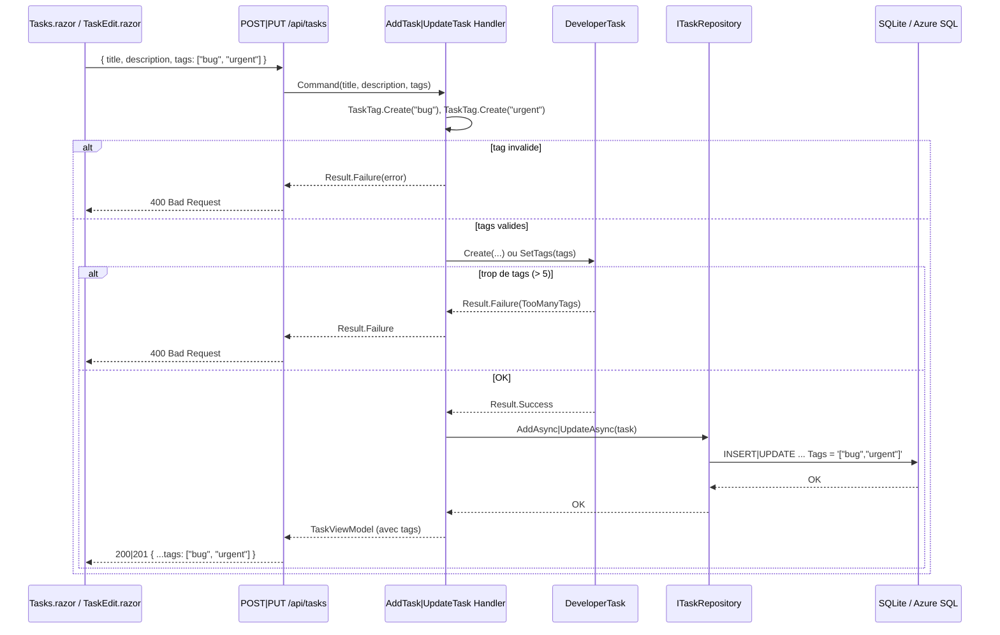
```mermaid
sequenceDiagram
    participant UI as Tasks.razor / TaskEdit.razor
    participant API as POST|PUT /api/tasks
    participant H as AddTask|UpdateTask Handler
    participant T as DeveloperTask
    participant R as ITaskRepository
    participant DB as SQLite / Azure SQL

    UI->>API: { title, description, tags: ["bug", "urgent"] }
    API->>H: Command(title, description, tags)
    H->>H: TaskTag.Create("bug"), TaskTag.Create("urgent")
    alt tag invalide
        H-->>API: Result.Failure(error)
        API-->>UI: 400 Bad Request
    else tags valides
        H->>T: Create(...) ou SetTags(tags)
        alt trop de tags (> 5)
            T-->>H: Result.Failure(TooManyTags)
            H-->>API: Result.Failure
            API-->>UI: 400 Bad Request
        else OK
            T-->>H: Result.Success
            H->>R: AddAsync|UpdateAsync(task)
            R->>DB: INSERT|UPDATE ... Tags = '["bug","urgent"]'
            DB-->>R: OK
            R-->>H: OK
            H-->>API: TaskViewModel (avec tags)
            API-->>UI: 200|201 { ...tags: ["bug", "urgent"] }
        end
    end
```

**Contraintes techniques :**

| Élément | Décision |
|---|---|
| Value Object | `TaskTag` : `string Value`, max 30 caractères, trimé, non vide |
| Limite par tâche | **5 tags maximum** |
| Stockage | Colonne `Tags` en JSON (`nvarchar(max)`) sur la table `Tasks` |
| Unicité | Insensible à la casse au sein d'une même tâche (pas de doublons) |
| Couleurs | Palette de ~10 couleurs prédéfinies, attribution par hash du nom du tag |
| Renommage | Pas de renommage atomique : supprimer l'ancien + ajouter le nouveau |

**Palette de couleurs automatiques :**

| Index | Couleur (CSS class) | Exemple visuel |
|---|---|---|
| 0 | `bg-primary` | bleu |
| 1 | `bg-success` | vert |
| 2 | `bg-danger` | rouge |
| 3 | `bg-warning text-dark` | jaune |
| 4 | `bg-info text-dark` | cyan |
| 5 | `bg-secondary` | gris |
| 6 | `bg-purple` (custom) | violet |
| 7 | `bg-orange` (custom) | orange |
| 8 | `bg-teal` (custom) | sarcelle |
| 9 | `bg-pink` (custom) | rose |

Attribution : `hash(tag.ToLowerInvariant()) % 10 → index palette`

**Changements architecturaux :**

*Domain — `TaskTag` (nouveau Value Object) :*
```
TaskTag { string Value, MaxLength = 30, Create(string) → Result<TaskTag> }
```

*Domain — `DeveloperTask` (évolution) :*
```
+IReadOnlyList<TaskTag> Tags
+SetTags(IReadOnlyList<TaskTag> tags) → Result   // max 5, pas de doublons
+Create(title, description, createdAt, ownerId, tags?) → DeveloperTask
```

*Domain — `DomainErrors.Tasks` (évolution) :*
```
+TagEmpty, +TagTooLong, +TooManyTags, +DuplicateTag
```

*Application — `AddTaskCommand` (évolution) :*
```
AddTaskCommand(string Title, string? Description, List<string>? Tags)
```

*Application — `UpdateTaskCommand` (évolution) :*
```
UpdateTaskCommand(Guid TaskId, string Title, string? Description, List<string>? Tags)
```

*Application — `TaskViewModel` (évolution) :*
```
+List<string> Tags
```

*Infrastructure — `TaskConfiguration` (évolution) :*
- Colonne `Tags` : `nvarchar(max)`, JSON sérialisé, valeur par défaut `"[]"`
- Value converter : `IReadOnlyList<TaskTag>` ↔ JSON string

*API — endpoints (évolution) :*
- `POST /api/tasks` : body accepte `tags: ["bug", "urgent"]`
- `PUT /api/tasks/{id}` : body accepte `tags: ["bug", "urgent"]`
- Réponses : `TaskViewModel` inclut `tags`

*UI — `Tasks.razor` (Web + MAUI) :*
- Zone de saisie chips : `<input>` + Entrée → badge avec ✕
- Affichage dans la liste : badges colorés après le titre
- Champ désactivé si 5 tags atteints

*UI — `TaskEdit.razor` (Web + MAUI) :*
- Même composant chips que Tasks.razor
- Pré-rempli avec les tags existants

**Critères d'acceptance :**
- [ ] Un tag est un texte libre de 1 à 30 caractères, trimé
- [ ] Maximum 5 tags par tâche
- [ ] Pas de doublons (comparaison insensible à la casse)
- [ ] Les tags sont ajoutés via champ texte + Entrée (style chips/badges)
- [ ] Les tags sont visibles sur la page Tasks avec des couleurs automatiques
- [ ] Les couleurs sont déterminées par hash du nom du tag
- [ ] Les tags peuvent être ajoutés à la création ET à l'édition
- [ ] Les tags peuvent être supprimés (✕ sur le badge)
- [ ] Le renommage se fait par suppression + ajout
- [ ] Les tags sont persistés en JSON dans la base de données
- [ ] Les tags sont présents dans les réponses API (`TaskViewModel`)
- [ ] Disponible sur Web et MAUI
- [ ] Aucune régression sur UC-01, UC-02, UC-03, UC-04, UC-05, UC-12

**Tests à écrire :**

*Domain (`DeveloperTaskTests`) :*
- `Should_CreateTaskWithTags_When_TagsProvided`
- `Should_CreateTaskWithoutTags_When_NoTagsProvided`
- `Should_SetTags_When_ValidTags`
- `Should_FailSetTags_When_TooManyTags`
- `Should_FailSetTags_When_DuplicateTag`

*Domain (`TaskTagTests`) :*
- `Should_CreateTag_When_ValidValue`
- `Should_FailCreate_When_EmptyValue`
- `Should_FailCreate_When_TooLongValue`
- `Should_TrimTag_When_Created`

*Application (`AddTaskCommandHandlerTests`) :*
- `Should_CreateTaskWithTags_When_TagsProvided`
- `Should_CreateTaskWithoutTags_When_NoTagsProvided`
- `Should_Fail_When_TagInvalid`

*Application (`UpdateTaskCommandHandlerTests`) :*
- `Should_UpdateTags_When_TagsProvided`
- `Should_ClearTags_When_EmptyTagsList`
- `Should_Fail_When_TooManyTags`

---

## Bounded Context : Pomodoro

### Modèle du domaine

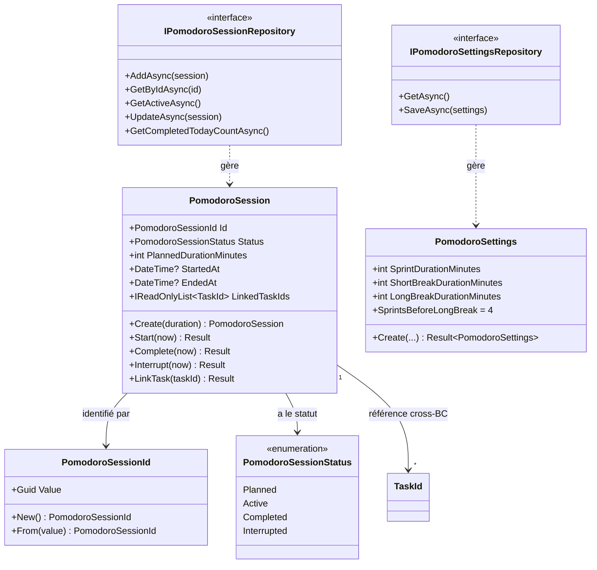
```mermaid
classDiagram
    class PomodoroSession {
        +PomodoroSessionId Id
        +PomodoroSessionStatus Status
        +int PlannedDurationMinutes
        +DateTime? StartedAt
        +DateTime? EndedAt
        +IReadOnlyList~TaskId~ LinkedTaskIds
        +Create(duration) PomodoroSession
        +Start(now) Result
        +Complete(now) Result
        +Interrupt(now) Result
        +LinkTask(taskId) Result
    }

    class PomodoroSessionId {
        +Guid Value
        +New() PomodoroSessionId
        +From(value) PomodoroSessionId
    }

    class PomodoroSessionStatus {
        <<enumeration>>
        Planned
        Active
        Completed
        Interrupted
    }

    class PomodoroSettings {
        +int SprintDurationMinutes
        +int ShortBreakDurationMinutes
        +int LongBreakDurationMinutes
        +SprintsBeforeLongBreak = 4
        +Create(...) Result~PomodoroSettings~
    }

    class IPomodoroSessionRepository {
        <<interface>>
        +AddAsync(session)
        +GetByIdAsync(id)
        +GetActiveAsync()
        +UpdateAsync(session)
        +GetCompletedTodayCountAsync()
    }

    class IPomodoroSettingsRepository {
        <<interface>>
        +GetAsync()
        +SaveAsync(settings)
    }

    PomodoroSession --> PomodoroSessionId : identifié par
    PomodoroSession --> PomodoroSessionStatus : a le statut
    PomodoroSession "1" --> "*" TaskId : référence cross-BC
    IPomodoroSessionRepository ..> PomodoroSession : gère
    IPomodoroSettingsRepository ..> PomodoroSettings : gère
```

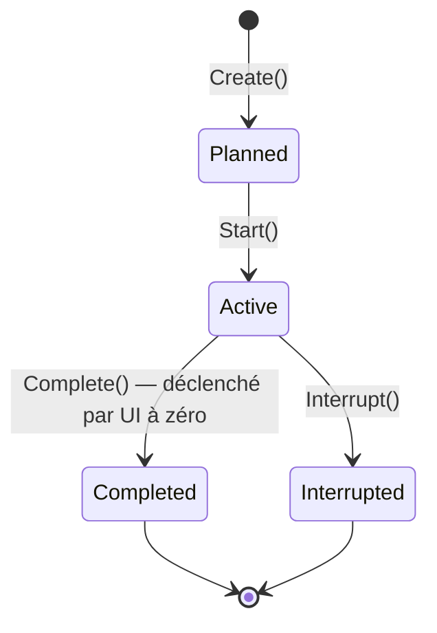
```mermaid
stateDiagram-v2
    [*] --> Planned : Create()
    Planned --> Active : Start()
    Active --> Completed : Complete() — déclenché par UI à zéro
    Active --> Interrupted : Interrupt()
    Completed --> [*]
    Interrupted --> [*]
```

> Règle cross-BC : `PomodoroSession` référence `TaskId` (BC Tasks) par valeur uniquement.
> Aucun objet `DeveloperTask` ne traverse la frontière du BC.

---

### UC-05 — Configurer les durées Pomodoro

**Acteur principal :** Développeur
**Parties prenantes :** —
**Préconditions :** —
**Postconditions (succès) :** les durées sont persistées et effectives au prochain sprint.

**Scénario nominal :**
1. Le développeur saisit les durées : sprint, pause courte, pause longue.
2. Le système valide chaque durée (1–120 minutes).
3. Le système sauvegarde les paramètres.

**Scénarios alternatifs :** —

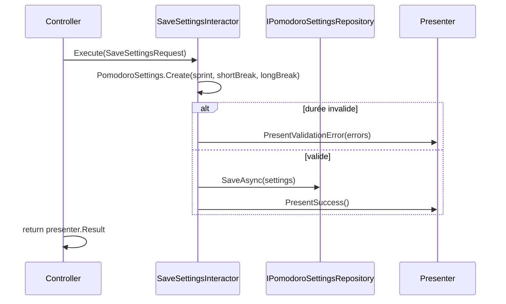
```mermaid
sequenceDiagram
    participant C as Controller
    participant I as SaveSettingsInteractor
    participant R as IPomodoroSettingsRepository
    participant P as Presenter

    C->>I: Execute(SaveSettingsRequest)
    I->>I: PomodoroSettings.Create(sprint, shortBreak, longBreak)
    alt durée invalide
        I->>P: PresentValidationError(errors)
    else valide
        I->>R: SaveAsync(settings)
        I->>P: PresentSuccess()
    end
    C->>C: return presenter.Result
```

**Scénarios d'exception :**
- E1 : une durée < 1 minute → rejetée.
- E2 : une durée > 120 minutes → rejetée.

**Critères d'acceptance :**
- [x] Durées dans [1, 120] → acceptées et persistées
- [x] Durée hors plage → rejetée, rien sauvegardé
- [x] Les durées sont chargées au démarrage de l'application
- [x] UI dédiée pour modifier les paramètres (/settings)

---

### UC-06 — Démarrer un sprint

**Acteur principal :** Développeur
**Parties prenantes :** —
**Préconditions :** aucun sprint `Active` en cours.
**Postconditions (succès) :** session créée au statut `Active`, durée configurée stockée dans la session.

**Scénario nominal :**
1. Le développeur demande le démarrage d'un sprint.
2. Le système vérifie qu'aucun sprint n'est déjà actif.
3. Le système lit la durée configurée.
4. Le système crée la session et la passe à `Active`.
5. Le système retourne la session avec sa durée pour lancer le chrono côté UI.

**Scénarios alternatifs :** —

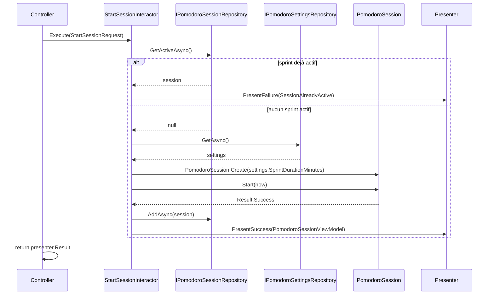
```mermaid
sequenceDiagram
    participant C as Controller
    participant I as StartSessionInteractor
    participant SR as IPomodoroSessionRepository
    participant SS as IPomodoroSettingsRepository
    participant S as PomodoroSession
    participant P as Presenter

    C->>I: Execute(StartSessionRequest)
    I->>SR: GetActiveAsync()
    alt sprint déjà actif
        SR-->>I: session
        I->>P: PresentFailure(SessionAlreadyActive)
    else aucun sprint actif
        SR-->>I: null
        I->>SS: GetAsync()
        SS-->>I: settings
        I->>S: PomodoroSession.Create(settings.SprintDurationMinutes)
        I->>S: Start(now)
        S-->>I: Result.Success
        I->>SR: AddAsync(session)
        I->>P: PresentSuccess(PomodoroSessionViewModel)
    end
    C->>C: return presenter.Result
```

**Scénarios d'exception :**
- E1 : un sprint est déjà `Active` → erreur, aucune session créée.

**Critères d'acceptance :**
- [ ] Session créée avec statut `Active`
- [ ] `StartedAt` renseigné
- [ ] `PlannedDurationMinutes` = durée configurée au moment du démarrage
- [ ] Deux sprints simultanés impossibles

---

### UC-07 — Lier une tâche au sprint

**Acteur principal :** Développeur
**Parties prenantes :** —
**Préconditions :** sprint `Active`, tâche identifiée existe, non déjà liée.
**Postconditions (succès) :** le `TaskId` est ajouté à `LinkedTaskIds` de la session.

**Scénario nominal :**
1. Le développeur désigne une tâche à lier au sprint actif.
2. Le système vérifie qu'un sprint est actif.
3. Le système vérifie que la tâche existe.
4. Le système lie la tâche au sprint.

**Scénarios alternatifs :** —

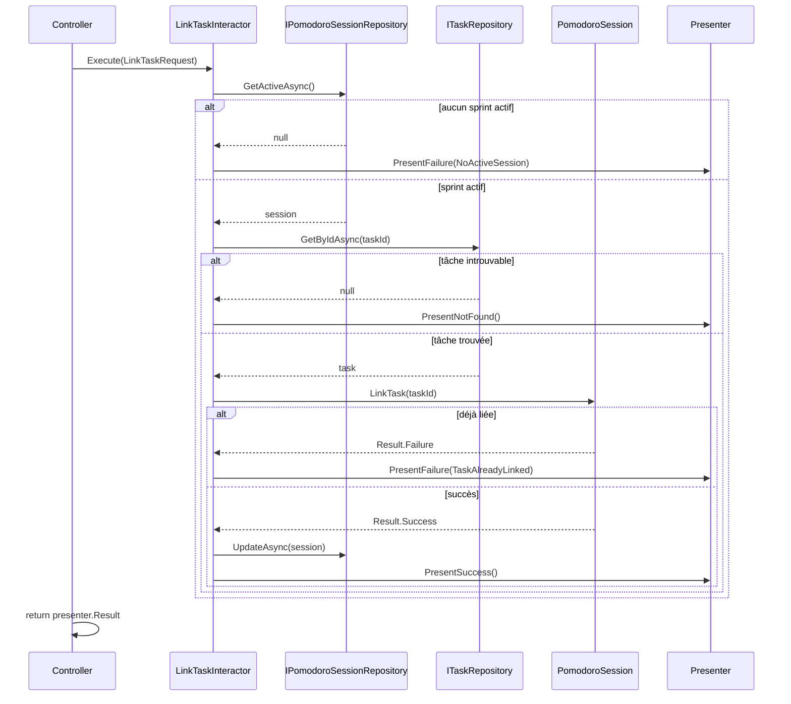
```mermaid
sequenceDiagram
    participant C as Controller
    participant I as LinkTaskInteractor
    participant SR as IPomodoroSessionRepository
    participant TR as ITaskRepository
    participant S as PomodoroSession
    participant P as Presenter

    C->>I: Execute(LinkTaskRequest)
    I->>SR: GetActiveAsync()
    alt aucun sprint actif
        SR-->>I: null
        I->>P: PresentFailure(NoActiveSession)
    else sprint actif
        SR-->>I: session
        I->>TR: GetByIdAsync(taskId)
        alt tâche introuvable
            TR-->>I: null
            I->>P: PresentNotFound()
        else tâche trouvée
            TR-->>I: task
            I->>S: LinkTask(taskId)
            alt déjà liée
                S-->>I: Result.Failure
                I->>P: PresentFailure(TaskAlreadyLinked)
            else succès
                S-->>I: Result.Success
                I->>SR: UpdateAsync(session)
                I->>P: PresentSuccess()
            end
        end
    end
    C->>C: return presenter.Result
```

**Scénarios d'exception :**
- E1 : aucun sprint actif → erreur.
- E2 : tâche introuvable → `NotFound`.
- E3 : tâche déjà liée → erreur métier.

**Critères d'acceptance :**
- [ ] `TaskId` présent dans `LinkedTaskIds` après liaison
- [ ] Liaison dupliquée rejetée
- [ ] Tâche inexistante → rejetée

---

### UC-08 — Mettre à jour le statut d'une tâche depuis le sprint

**Acteur principal :** Développeur
**Parties prenantes :** —
**Préconditions :** sprint `Active`, tâche liée au sprint.
**Postconditions (succès) :** statut de la tâche mis à jour (`InProgress` ou `Done`).

**Scénario nominal :**
1. Le développeur choisit une tâche liée et le nouveau statut.
2. Le système vérifie qu'un sprint est actif.
3. Le système vérifie que la tâche est liée au sprint.
4. Le système met à jour le statut de la tâche.

**Scénarios alternatifs :** —

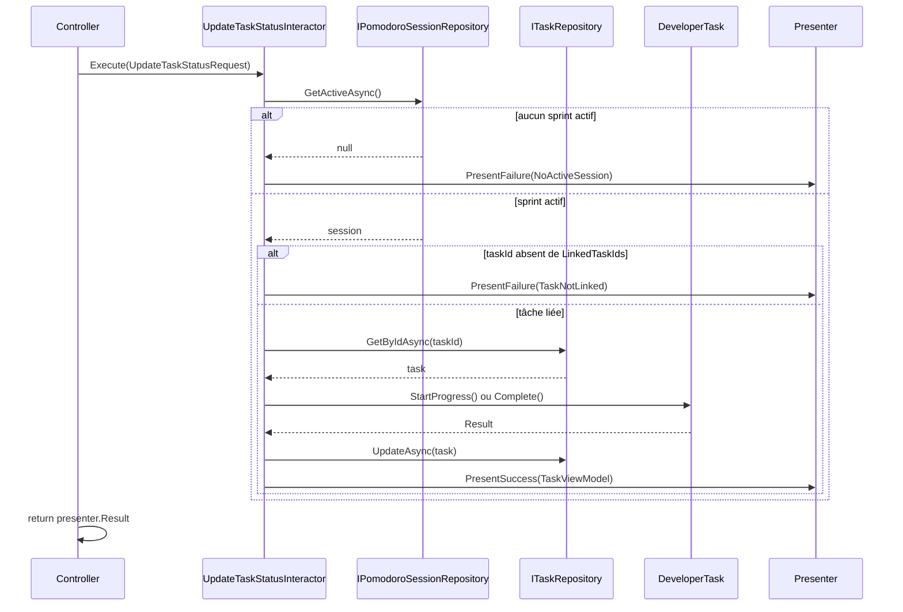
```mermaid
sequenceDiagram
    participant C as Controller
    participant I as UpdateTaskStatusInteractor
    participant SR as IPomodoroSessionRepository
    participant TR as ITaskRepository
    participant T as DeveloperTask
    participant P as Presenter

    C->>I: Execute(UpdateTaskStatusRequest)
    I->>SR: GetActiveAsync()
    alt aucun sprint actif
        SR-->>I: null
        I->>P: PresentFailure(NoActiveSession)
    else sprint actif
        SR-->>I: session
        alt taskId absent de LinkedTaskIds
            I->>P: PresentFailure(TaskNotLinked)
        else tâche liée
            I->>TR: GetByIdAsync(taskId)
            TR-->>I: task
            I->>T: StartProgress() ou Complete()
            T-->>I: Result
            I->>TR: UpdateAsync(task)
            I->>P: PresentSuccess(TaskViewModel)
        end
    end
    C->>C: return presenter.Result
```

**Scénarios d'exception :**
- E1 : aucun sprint actif → erreur.
- E2 : tâche non liée au sprint → erreur.
- E3 : transition invalide (ex. `Done → InProgress`) → erreur métier.

**Critères d'acceptance :**
- [ ] `Pending → InProgress` accepté
- [ ] `InProgress → Done` accepté
- [ ] Rétrogradation depuis `Done` rejetée
- [ ] Tâche non liée au sprint → rejetée

---

### UC-09 — Créer une tâche pendant un sprint

**Acteur principal :** Développeur
**Parties prenantes :** —
**Préconditions :** sprint `Active`.
**Postconditions (succès) :** tâche créée (`Pending`), automatiquement liée au sprint actif.

**Scénario nominal :**
1. Le développeur saisit un titre de tâche depuis l'écran du sprint.
2. Le système vérifie qu'un sprint est actif.
3. Le système valide le titre.
4. Le système crée la tâche et la lie au sprint.

**Scénarios alternatifs :** —

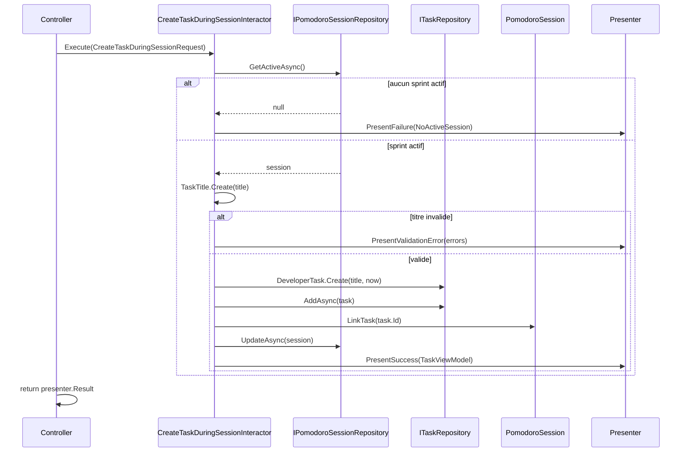
```mermaid
sequenceDiagram
    participant C as Controller
    participant I as CreateTaskDuringSessionInteractor
    participant SR as IPomodoroSessionRepository
    participant TR as ITaskRepository
    participant S as PomodoroSession
    participant P as Presenter

    C->>I: Execute(CreateTaskDuringSessionRequest)
    I->>SR: GetActiveAsync()
    alt aucun sprint actif
        SR-->>I: null
        I->>P: PresentFailure(NoActiveSession)
    else sprint actif
        SR-->>I: session
        I->>I: TaskTitle.Create(title)
        alt titre invalide
            I->>P: PresentValidationError(errors)
        else valide
            I->>TR: DeveloperTask.Create(title, now)
            I->>TR: AddAsync(task)
            I->>S: LinkTask(task.Id)
            I->>SR: UpdateAsync(session)
            I->>P: PresentSuccess(TaskViewModel)
        end
    end
    C->>C: return presenter.Result
```

**Scénarios d'exception :**
- E1 : aucun sprint actif → erreur.
- E2 : titre vide ou > 200 caractères → erreur de validation.

**Critères d'acceptance :**
- [ ] Tâche créée dans le BC Tasks avec statut `Pending`
- [ ] `TaskId` présent dans `LinkedTaskIds` du sprint
- [ ] Sprint non actif → rejeté

---

### UC-10 — Interrompre un sprint

**Acteur principal :** Développeur
**Parties prenantes :** —
**Préconditions :** sprint `Active`.
**Postconditions (succès) :** session passe à `Interrupted`, `EndedAt` renseigné, aucune pause lancée.

**Scénario nominal :**
1. Le développeur demande l'interruption du sprint en cours.
2. Le système vérifie qu'un sprint est actif.
3. Le système passe la session à `Interrupted` et enregistre `EndedAt`.

**Scénarios alternatifs :** —

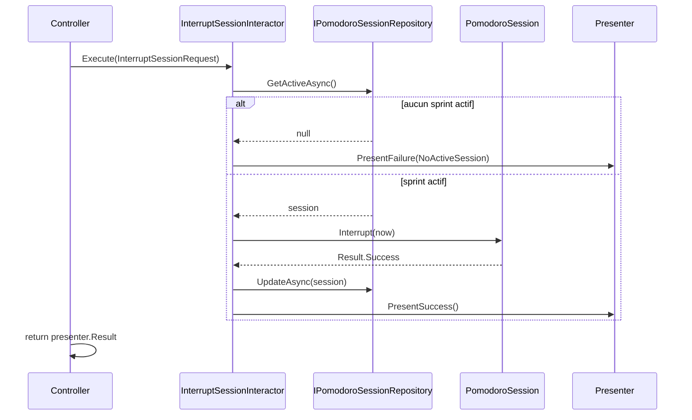
```mermaid
sequenceDiagram
    participant C as Controller
    participant I as InterruptSessionInteractor
    participant R as IPomodoroSessionRepository
    participant S as PomodoroSession
    participant P as Presenter

    C->>I: Execute(InterruptSessionRequest)
    I->>R: GetActiveAsync()
    alt aucun sprint actif
        R-->>I: null
        I->>P: PresentFailure(NoActiveSession)
    else sprint actif
        R-->>I: session
        I->>S: Interrupt(now)
        S-->>I: Result.Success
        I->>R: UpdateAsync(session)
        I->>P: PresentSuccess()
    end
    C->>C: return presenter.Result
```

**Scénarios d'exception :**
- E1 : aucun sprint actif → erreur.

**Critères d'acceptance :**
- [ ] Statut `Interrupted`, `EndedAt` renseigné
- [ ] Aucune pause démarrée
- [ ] Sprint interrompu comptabilisé séparément des sprints complétés

---

### UC-11 — Terminer un sprint

**Acteur principal :** Système (UI Blazor — chrono à zéro)
**Parties prenantes :** Développeur (reçoit le signal de pause)
**Préconditions :** sprint `Active`.
**Postconditions (succès) :** session `Completed`, `EndedAt` renseigné, type de pause calculé et retourné.

**Scénario nominal :**
1. Le chrono UI atteint zéro.
2. L'UI appelle l'endpoint de complétion.
3. Le système vérifie qu'un sprint est actif.
4. Le système passe la session à `Completed` et enregistre `EndedAt`.
5. Le système compte les sprints complétés aujourd'hui.
6. Le système retourne le type de pause (courte ou longue) et sa durée.

**Scénarios alternatifs :**
- A1 : `count % 4 == 0` → pause longue. Sinon → pause courte.

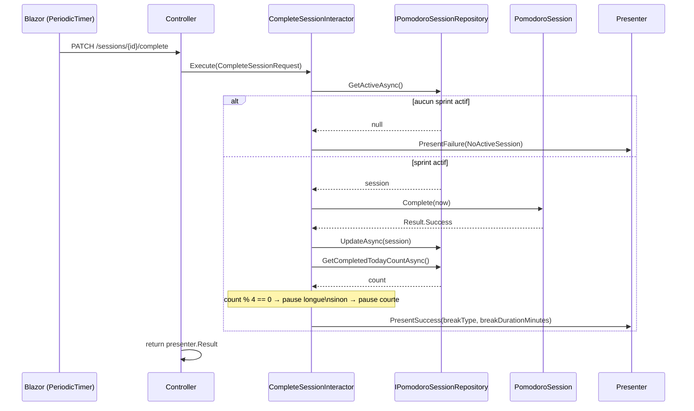
```mermaid
sequenceDiagram
    participant UI as Blazor (PeriodicTimer)
    participant C as Controller
    participant I as CompleteSessionInteractor
    participant R as IPomodoroSessionRepository
    participant S as PomodoroSession
    participant P as Presenter

    UI->>C: PATCH /sessions/{id}/complete
    C->>I: Execute(CompleteSessionRequest)
    I->>R: GetActiveAsync()
    alt aucun sprint actif
        R-->>I: null
        I->>P: PresentFailure(NoActiveSession)
    else sprint actif
        R-->>I: session
        I->>S: Complete(now)
        S-->>I: Result.Success
        I->>R: UpdateAsync(session)
        I->>R: GetCompletedTodayCountAsync()
        R-->>I: count
        note over I: count % 4 == 0 → pause longue\nsinon → pause courte
        I->>P: PresentSuccess(breakType, breakDurationMinutes)
    end
    C->>C: return presenter.Result
```

**Scénarios d'exception :**
- E1 : aucun sprint actif (incohérence UI) → erreur ignorée côté UI.

**Critères d'acceptance :**
- [ ] Statut `Completed`, `EndedAt` renseigné
- [ ] Après 4 complétés → pause longue, sinon pause courte
- [ ] Durée de pause = valeur configurée correspondante
- [ ] Le compteur ne tient compte que des sessions `Completed` du jour courant

---

## Bounded Context : Journal (à venir)

> Use cases à détailler lors de l'itération concernée.

**Concept clé :** log d'activité quotidien généré automatiquement à partir des sprints Pomodoro et des tâches. Répond à la question *"qu'est-ce que j'ai fait aujourd'hui ?"*.

---

## Bounded Context : Tickets — Intégration Jira ✅ (itération #13)

**Concept clé :** intégration en lecture avec Jira Cloud. Les tickets sont récupérés en direct depuis l'API Jira (pas de stockage local). Seul le lien `JiraTicketKey` (ex. `PROJ-123`) est persisté sur une tâche Kairudev.

### UC-T01 — Lister les tickets Jira assignés à l'utilisateur

**Acteur principal :** Développeur
**Préconditions :** Credentials Jira configurés (BaseUrl, Email, ApiToken)
**Postconditions :** Liste des tickets affichée (clé, résumé, statut, priorité)

**Scénario nominal :**
1. L'utilisateur ouvre la page Tickets
2. Le système récupère les credentials depuis `UserSettings`
3. `JiraApiClient` appelle `GET /rest/api/3/search?jql=assignee=currentUser()`
4. La liste est affichée avec clé, résumé, statut et priorité

**Scénarios d'exception :**
- E1 : Credentials non configurés → message "Configurer dans les paramètres"
- E2 : Erreur réseau ou API → message d'erreur HTTP

### UC-T02 — Lier un ticket Jira à une tâche Kairudev

**Acteur principal :** Développeur
**Préconditions :** La tâche existe
**Postconditions :** `JiraTicketKey` persisté sur la tâche

**Scénario nominal :**
1. L'utilisateur saisit une clé Jira (`PROJ-123`) sur une tâche
2. Le système valide le format (`^[A-Z]+-\d+$`)
3. La clé est persistée et affichée comme badge sur la tâche

**Scénarios alternatifs :**
- A1 : Tâche déjà liée → la clé est remplacée

**Critères d'acceptance :**
- [x] Format `[A-Z]+-[0-9]+` validé côté Domain
- [x] Persisté en base, survit au redémarrage

### UC-T03 — Délier un ticket Jira d'une tâche

**Acteur principal :** Développeur
**Postconditions :** `JiraTicketKey = null` sur la tâche

### UC-T04 — Configurer les credentials Jira (dans Settings)

**Acteur principal :** Développeur
**Postconditions :** BaseUrl, Email, ApiToken persistés dans `UserSettings`

```mermaid
sequenceDiagram
    actor U as Utilisateur
    participant UI as Page Tickets
    participant API as Api REST
    participant H as GetAssignedJiraTicketsQueryHandler
    participant S as JiraApiClient
    participant J as Jira Cloud API

    U->>UI: Ouvre la page Tickets
    UI->>API: GET /api/tickets/assigned
    API->>H: Handle(query)
    H->>H: GetAsync() → UserSettings
    H->>S: GetAssignedTicketsAsync(url, email, token)
    S->>J: GET /rest/api/3/search?jql=assignee=currentUser()
    J-->>S: [{key, summary, status, priority}]
    S-->>H: Result<List<JiraTicketDto>>
    H-->>API: Result
    API-->>UI: 200 [{key, summary, status}]
    UI-->>U: Liste des tickets
```

---

## Bounded Context : Identity ✅ (itérations #15 + #15b)

**Concept clé :** authentification via GitHub OAuth 2.0. L'identité d'un utilisateur est son compte GitHub. Un JWT HS256 est émis après le callback OAuth et stocké côté client (localStorage Web / SecureStorage MAUI).

### Modèle du domaine

```mermaid
classDiagram
    class User {
        +UserId Id
        +string GitHubId
        +string Login
        +string DisplayName
        +string? Email
        +Create(githubId, login, displayName, email?) User
    }

    class UserId {
        +string Value
        +From(string) UserId
    }

    class IUserRepository {
        <<interface>>
        +GetByGitHubIdAsync(string githubId)
        +AddAsync(User user)
    }

    User --> UserId : identifié par
    IUserRepository ..> User : gère
```

---

### UC-A01 — Se connecter via GitHub OAuth

**Acteur principal :** Développeur
**Parties prenantes :** —
**Préconditions :** GitHub OAuth App configurée (ClientId, ClientSecret, CallbackUrl)
**Postconditions (succès) :** JWT retourné, utilisateur créé en base si premier login, client redirigé vers `/dashboard`

**Scénario nominal :**
1. Le développeur clique sur "Se connecter avec GitHub" (landing page ou login page)
2. Le client navigue vers `GET /api/auth/github`
3. L'API redirige vers GitHub OAuth (`authorize`)
4. L'utilisateur s'authentifie sur GitHub et autorise l'application
5. GitHub redirige vers `GET /api/auth/github/callback?code=...`
6. L'API échange le code contre un access token GitHub
7. L'API récupère le profil GitHub (`login`, `id`, `name`, `email`)
8. L'API appelle `GetOrCreateUserCommandHandler` (crée l'utilisateur si nécessaire)
9. L'API génère un JWT HS256 (claims : `sub=UserId`, `name`, `login`)
10. L'API redirige vers `{WebBaseUrl}/login#token={jwt}`
11. La page `Login.razor` extrait le token du fragment, le stocke, met à jour l'état auth
12. L'utilisateur est redirigé vers `/dashboard`

**Scénarios d'exception :**
- E1 : GitHub OAuth refusé → `{WebBaseUrl}/login#auth-error=denied`
- E2 : GitHub ID non reçu → `{WebBaseUrl}/login#auth-error=no-id`
- E3 : Erreur serveur → `{WebBaseUrl}/login#auth-error=server`

**Critères d'acceptance :**
- [x] Redirection GitHub → callback → JWT en un seul flux
- [x] Utilisateur créé au premier login, retrouvé aux suivants
- [x] JWT valide 24h (configurable)
- [x] Cookie session intermédiaire (non persisté, pour OAuth callback uniquement)
- [x] `WebBaseUrl` configurable sans redéploiement

```mermaid
sequenceDiagram
    actor U as Utilisateur
    participant C as Blazor (Home/Login)
    participant API as AuthController
    participant GH as GitHub OAuth
    participant H as GetOrCreateUserHandler

    U->>C: Clic "Se connecter avec GitHub"
    C->>API: GET /api/auth/github
    API->>GH: Redirect /authorize
    GH-->>U: Page de consentement GitHub
    U->>GH: Autorisation accordée
    GH->>API: GET /callback?code=...
    API->>GH: POST /access_token
    GH-->>API: access_token
    API->>GH: GET /user
    GH-->>API: {id, login, name, email}
    API->>H: GetOrCreateUserCommand
    H-->>API: User (créé ou retrouvé)
    API->>API: Génère JWT HS256
    API-->>C: Redirect /login#token=...
    C->>C: Stocke JWT, setState
    C->>C: NavigateTo("/dashboard")
```

---

### UC-A02 — Se déconnecter

**Acteur principal :** Développeur
**Préconditions :** Utilisateur authentifié
**Postconditions :** JWT supprimé du stockage client, état auth réinitialisé, retour landing page

**Scénario nominal :**
1. Le développeur clique sur le bouton de déconnexion (icône SVG dans NavMenu)
2. Le client supprime le JWT du localStorage (Web) ou SecureStorage (MAUI)
3. L'état d'authentification Blazor est réinitialisé (utilisateur anonyme)
4. L'utilisateur est redirigé vers `/` (landing page)

**Critères d'acceptance :**
- [x] JWT supprimé du stockage local
- [x] Toutes les pages `[Authorize]` redirigent vers `/login` après déconnexion
- [x] Aucun appel serveur nécessaire (JWT stateless)

---

### UC-A03 — Accéder à une page protégée

**Acteur principal :** Développeur
**Préconditions :** Page marquée `[Authorize]`
**Postconditions :** Page affichée si authentifié ; redirection `/login` sinon

**Scénario nominal :**
1. Le développeur navigue vers une page protégée (ex. `/dashboard`, `/tasks`)
2. `AuthorizeRouteView` vérifie l'état d'authentification via `JwtAuthenticationStateProvider`
3. Si JWT valide en localStorage → page affichée
4. Si absent ou expiré → redirection vers `/login`

**Critères d'acceptance :**
- [x] `[Authorize]` sur Dashboard, Tasks, Pomodoro, Journal, Settings, Tickets
- [x] `[AllowAnonymous]` sur Home (landing) et Login
- [x] Redirection automatique `/dashboard` si déjà authentifié sur Home et Login

---

## ADR (Architecture Decision Records)

### ADR-001 — Clean Architecture + boundary pattern
- **Contexte :** Besoin d'une base solide, évolutive, testable, multi-UI (Web + MAUI).
- **Décision :** Couches Domain / Application / Adapters / Infrastructure. Boundary pattern complet : chaque Use Case expose un `IInputBoundary` et un `IOutputBoundary`. L'Interactor ne retourne rien — il pousse le résultat via le presenter.
- **Conséquences :** Use Cases indépendants de l'UI et de la persistance. Ajout Web/MAUI sans toucher au Domain.

### ADR-002 — SQLite via EF Core (fichier local)
- **Contexte :** Première itération, zéro infrastructure.
- **Décision :** SQLite + EF Core, fichier `kairudev.db` exclu du git. `ITaskRepository` dans Domain, implémentation dans Infrastructure.
- **Conséquences :** Swap PostgreSQL = nouvelle implémentation, aucun impact sur Domain/Application.

### ADR-003 — .NET 10 preview
- **Contexte :** Choix imposé.
- **Décision :** Cible `net10.0`. Warning `NETSDK1057` non bloquant.
- **Conséquences :** À surveiller lors du passage en release.

### ADR-004 — Controllers composent les Interactors
- **Contexte :** Le presenter HTTP est spécifique à chaque requête.
- **Décision :** Le Controller instancie le presenter et l'Interactor à chaque action, avec `ITaskRepository` injecté via DI.
- **Conséquences :** Composition explicite, pas de factory supplémentaire.

### ADR-005 — Blazor WebAssembly standalone
- **Contexte :** Cible multi-UI, partage futur de composants avec MAUI via Blazor Hybrid.
- **Décision :** Blazor WASM standalone, communication uniquement via API REST. `TaskDto` défini dans le projet Web.
- **Conséquences :** Projet Web totalement découplé du backend.

### ADR-006 — Timer côté client
- **Contexte :** La fin de sprint doit être automatique ; pas d'infrastructure serveur temps-réel.
- **Décision :** Le chrono tourne dans Blazor WASM (`PeriodicTimer` C#). À zéro, le client appelle `PATCH /api/pomodoro/sessions/{id}/complete`. Le serveur ne maintient aucun état de chrono.
- **Conséquences :** Architecture simple, sans WebSocket ni SignalR. Si l'onglet est fermé pendant un sprint, la session reste `Active` — acceptable pour v1.

### ADR-007 — Fusion Adapters dans Application
- **Contexte :** Le projet `Kairudev.Adapters` ne contient que des presenters génériques peu utilisés ; les presenters HTTP vivent déjà dans `Kairudev.Api`.
- **Décision :** À partir du BC Pomodoro, `Kairudev.Adapters` est supprimé. Les ViewModels et les presenters non-HTTP vivent dans `Kairudev.Application`. Les presenters HTTP restent dans `Kairudev.Api`.
- **Conséquences :** Solution simplifiée (un projet de moins). Le BC Tasks sera refactorisé en dette technique.

### ADR-008 — .NET MAUI avec Blazor Hybrid et duplication temporaire
- **Contexte :** Besoin d'une application native desktop/mobile sans refactoring majeur du code Blazor existant.
- **Décision :** Créer `Kairudev.Maui` avec `Microsoft.AspNetCore.Components.WebView.Maui`. Copier les pages Blazor (Tasks, Pomodoro, Journal, Settings) et les services API clients dans le projet MAUI. Communication uniquement via API REST (même URL que Blazor WASM). Aucune référence aux projets Domain/Application/Infrastructure.
- **Conséquences :**
  - **Avantage** : application native fonctionnelle immédiatement, réutilisation totale de l'UI Blazor.
  - **Dette technique** : duplication de code (pages + services). Solution future : extraire dans une Razor Class Library `Kairudev.Web.Shared` référencée par Web + MAUI.
  - **Clean Architecture respectée** : MAUI reste un pur adapter, le Domain ignore tout de l'UI.

### ADR-009 — Intégration Jira en lecture directe (pas de stockage local des tickets)
- **Contexte :** Le BC Tickets doit afficher les tickets Jira assignés à l'utilisateur. Deux options : synchronisation périodique en base, ou lecture directe à la demande.
- **Décision :** Lecture directe depuis l'API Jira Cloud REST v3 (`HttpClient` + Basic Auth). Seul le lien `JiraTicketKey` (ex. `PROJ-123`) est persisté sur `DeveloperTask`. Les données Jira (résumé, statut, priorité) ne sont jamais stockées localement.
- **Conséquences :**
  - **Avantage** : toujours à jour, pas de migration ni de job de synchro, implémentation minimale.
  - **Contrainte** : requiert une connexion à Jira pour afficher les tickets ; la page Tickets est vide si Jira est inaccessible.
  - **JiraApiToken stocké en clair** dans SQLite — dette technique à adresser (chiffrement) dans une itération future.

### ADR-010 — Cookie intermédiaire + JWT pour le flux OAuth GitHub
- **Contexte :** ASP.NET Core `AddOAuth` (famille `RemoteAuthenticationHandler`) exige un scheme de sign-in pour stocker l'état pendant le callback. Le scheme final étant JWT Bearer (stateless), il n'y a pas de scheme de sign-in par défaut.
- **Décision :** Ajouter `.AddCookie()` et configurer `DefaultSignInScheme = CookieAuthenticationDefaults.AuthenticationScheme`. Le cookie n'est utilisé que le temps du round-trip OAuth ; après émission du JWT, le client ne l'utilise plus. Toutes les API restent protégées par `JwtBearer` uniquement.
- **Conséquences :**
  - **Avantage** : solution standard ASP.NET Core, aucun middleware custom.
  - **Contrainte** : un cookie de session éphémère est émis pendant le callback (durée de vie très courte, non persisté côté client).
  - **Sécurité** : le JWT est transmis via fragment URL (`#token=...`), jamais en query string (non loggé dans les serveurs proxy).

### ADR-012 — BC Sprint : timer client-side sans état serveur en cours de session

- **Contexte :** Le BC Sprint libre utilise un chronomètre count-up (durée variable, non définie à l'avance). Deux options : créer un enregistrement serveur au démarrage (comme Pomodoro), ou ne persister qu'à la fin.
- **Décision :** Timer purement client-side. Le serveur ne connaît pas de sprint "en cours". L'API reçoit un unique `POST /api/sprints` à la fin, avec `startedAt`, `endedAt`, `outcome` (Completed|Interrupted) et `linkedTaskId?` fournis par le client.
- **Conséquences :**
  - **Avantage** : pas d'état fantôme en base (pas de sessions `InProgress` orphelines), implémentation minimale.
  - **Contrainte** : si l'onglet est fermé pendant un sprint, rien n'est enregistré — comportement voulu.
  - **Journal** : les entrées `SprintStarted` et `SprintCompleted/Interrupted` sont créées avec des timestamps rétroactifs (`startedAt` passé en paramètre). Les types d'événements Journal sont réutilisés tels quels (pas de nouveaux types `FreeSprintStarted/...`). Le journal ne distingue pas un sprint Pomodoro d'un sprint libre — comportement voulu pour v1.

### ADR-011 — Landing page `[AllowAnonymous]` + Dashboard `[Authorize]` + fragment URL pour JWT
- **Contexte :** Blazor WASM utilise `AuthorizeRouteView` qui intercepte toutes les navigations. La page d'accueil (`/`) doit être publique pour présenter le produit aux utilisateurs non connectés. Le JWT émis par l'API doit parvenir à Blazor sans être exposé dans l'historique HTTP.
- **Décision :**
  - `/` → `Home.razor` avec `[AllowAnonymous]` : landing page visible par tous, redirige vers `/dashboard` si déjà authentifié.
  - `/dashboard` → `Dashboard.razor` avec `[Authorize]` : page d'accueil post-login.
  - `/login` → `Login.razor` avec `[AllowAnonymous]` : récepteur du JWT via `uri.Fragment`.
  - Transport du JWT : l'API redirige vers `/login#token={jwt}`, Blazor lit `NavigationManager.Uri` pour extraire le fragment (les fragments ne sont pas envoyés aux serveurs HTTP).
- **Conséquences :**
  - **Avantage** : JWT jamais exposé dans les logs serveur ou proxy ; expérience utilisateur cohérente (landing → login → dashboard).
  - **Contrainte** : le fragment est visible dans l'URL le temps d'un rendu Blazor ; `Login.razor` doit nettoyer la barre d'adresse après extraction.
  - **Routing** : `AuthorizeRouteView` redirige vers `/login` (configurable via `<NotAuthorized>`) pour toutes les pages `[Authorize]`.

### ADR-013 — Markdig pour le rendu Markdown des descriptions de tâches
- **Contexte :** UC-T-13 (itération #18) introduit un éditeur Markdown pour les descriptions de tâches. Le rendu côté client (Blazor WASM) doit transformer le Markdown en HTML sans dépendance JS.
- **Décision :** Utiliser **Markdig** (NuGet `Markdig`) avec `UseAdvancedExtensions()`. Affichage via `@((MarkupString)html)` dans Blazor.
- **Conséquences :**
  - Aucun interop JS requis — Markdig est 100% C#, compatible WASM.
  - Sanitisation HTML incluse par défaut — pas d'injection XSS.
  - Ajout ~500 KB au bundle WASM (à surveiller).
  - `TaskDescription.MaxLength` porté de 1 000 → 5 000 caractères + migration EF Core.

---

## Bounded Context : Sprint

### Modèle du domaine

```mermaid
classDiagram
    class SprintSession {
        +SprintSessionId Id
        +SprintName Name
        +UserId OwnerId
        +DateTimeOffset StartedAt
        +DateTimeOffset EndedAt
        +SprintOutcome Outcome
        +TaskId? LinkedTaskId
        +Duration Duration (computed)
        +Record(name, ownerId, startedAt, endedAt, outcome, linkedTaskId?) SprintSession
    }

    class SprintSessionId {
        +Guid Value
        +New() SprintSessionId
    }

    class SprintName {
        +string Value
        +MaxLength = 200
        +Create(value) Result~SprintName~
    }

    class SprintOutcome {
        <<enumeration>>
        Completed
        Interrupted
    }

    class ISprintSessionRepository {
        <<interface>>
        +AddAsync(session)
        +GetByDateAsync(date, ownerId) IReadOnlyList~SprintSession~
    }

    SprintSession --> SprintSessionId : identifié par
    SprintSession --> SprintName : possède
    SprintSession --> SprintOutcome : résultat
    ISprintSessionRepository ..> SprintSession : gère
```

### Use Cases

| Code | Nom | Commande / Requête |
|---|---|---|
| SP-01 | RecordSprint | `RecordSprintCommand` |
| SP-02 | GetTodaySprints | `GetTodaySprintsQuery` |

### UC-SP-01 — Enregistrer un sprint libre

**Acteur principal :** Développeur
**Préconditions :** Utilisateur authentifié, sprint démarré côté client
**Postconditions (succès) :** Sprint persisté. Journal : entrée `SprintStarted` (rétroactive, timestamp = `startedAt`) + `SprintCompleted` ou `SprintInterrupted`. Types d'événements réutilisés depuis le BC Journal (ADR-012).

**Accès UX :**
- La page `/pomodoro` affiche un bouton **`···`** en haut à droite
- Au clic, un menu contextuel s'ouvre avec l'option **"Sprint libre"**
- Clic → navigation vers **`/pomodoro/libre`**
- Pas d'entrée dédiée dans le NavMenu (accès exclusivement via le menu `···`)

**Scénario nominal :**
1. L'utilisateur est sur `/pomodoro`, clique **`···`** → **"Sprint libre"** → arrive sur `/pomodoro/libre`
2. Il voit le champ "Nom du sprint" (défaut : "Sprint #N", N = nb sprints du jour + 1)
3. Il modifie le nom si souhaité (seulement avant démarrage)
4. Il sélectionne optionnellement une tâche liée dans un dropdown
5. Il clique **Démarrer** → le client mémorise `startedAt = now`, le chronomètre s'incrémente
6. Il clique **Terminer** → le client appelle `POST /api/sprints` avec `outcome=Completed`
7. Le sprint apparaît dans l'historique du jour (bas de page)

**Scénarios alternatifs :**
- A1 : Clic sur **Interrompre** → `POST /api/sprints` avec `outcome=Interrupted`, durée réelle enregistrée
- A2 : Nom vide → nom par défaut "Sprint #N"
- A3 : Aucune tâche sélectionnée → `linkedTaskId = null`

**Scénarios d'exception :**
- E1 : Fermeture de l'onglet pendant le chrono → rien n'est enregistré (timer abandonné, décision ADR-012)
- E2 : `endedAt <= startedAt` → erreur de validation domaine

**Critères d'acceptance :**
- [ ] Bouton `···` visible sur `/pomodoro`, ouvre un menu avec l'option "Sprint libre"
- [ ] "Sprint libre" navigue vers `/pomodoro/libre`
- [ ] Pas d'entrée dédiée dans le NavMenu
- [ ] Le chronomètre s'incrémente en temps réel (PeriodicTimer côté client)
- [ ] Le nom n'est plus modifiable une fois le sprint démarré
- [ ] La durée réelle (`endedAt - startedAt`) est persistée
- [ ] Le journal reçoit `SprintStarted` (timestamp = `startedAt`) + `SprintCompleted/Interrupted`
- [ ] L'historique du jour liste les sprints enregistrés avec nom, durée et résultat

### UC-SP-02 — Consulter les sprints du jour

**Acteur principal :** Développeur
**Préconditions :** Utilisateur authentifié, sur `/pomodoro/libre`
**Postconditions :** Liste des sprints enregistrés aujourd'hui, triés chronologiquement.

**Critères d'acceptance :**
- [ ] Affiche nom, durée, outcome et tâche liée (si présente) pour chaque sprint

